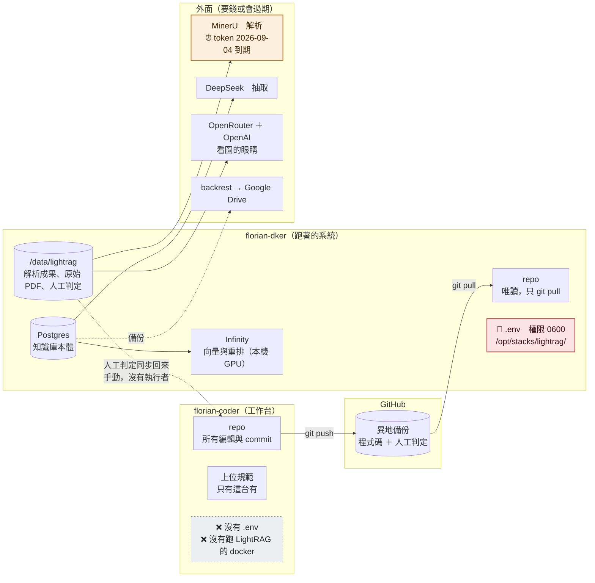
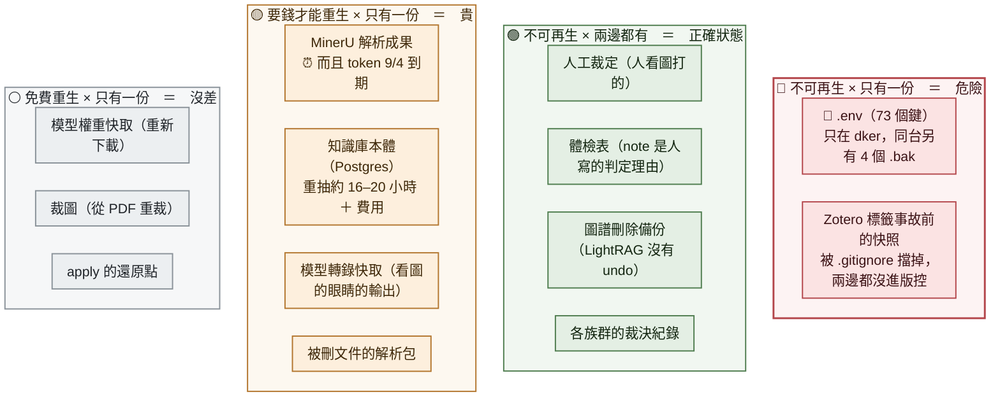

# 東西存在哪裡

**這張圖回答一個問題：如果某台機器死了，什麼救得回來、什麼救不回來。**

「檔案在哪個資料夾」不是重點。重點是 **`不可再生 × 只有一份`** 那一格裡有什麼 ——
2026-08-16 一天之內在那一格找到三樣東西，全部是人做出來的、全部只活在一顆磁碟上。

⚠ 大小是 2026-08-16 量的，會變。要現值就 `du -sh`。

---

## 一、三個地方，誰是權威



**⚠ 為什麼「我在 coder 上驗過了」在物理上做不到**：coder 沒有 `.env`、也沒有跑
LightRAG 的容器。凡是關於跑著的系統的陳述，一律要附 dker 的實跑輸出。

**⚠ 那條「人工判定同步回來」的箭頭是手動的。** `verdicts/README.md` 有可以直接貼的
指令，但**沒有任何東西在跑它** —— 2026-08-16 之前它已經漏了 298 份體檢表。

---

## 二、核心那張圖：死了救不救得回來



**🟢 那一格是 2026-08-16 才補起來的。** 在那之前三樣全部在 🔴：
人工裁定兩邊各缺一半、體檢表只備份了 6%、圖譜刪除備份 6 份裡只有 1 份進版控。

---

## 三、逐項對照表

| 東西 | 現役在哪 | 備份在哪 | 死了怎麼救 |
|---|---|---|---|
| 程式碼 | coder 的 repo | GitHub | `git clone` |
| **🔑 秘密（73 個鍵）** | dker `/opt/stacks/lightrag/.env` | ❌ **同一台的 4 個 `.bak`（同一顆碟）** | 跟五家服務重新申請 |
| 原始 PDF | dker `inbox/` ＋ `library/` | ❌ 沒有 | Zotero 還有（如果那邊還在） |
| **MinerU 解析成果** | dker `work/parsed/` | ❌ 沒有 | **重付 MinerU，而 token 9/4 到期** |
| **人工裁定** | dker `work/crops/<doc>/verified/` | ✅ git `verdicts/` | **不可能。人看圖打的** |
| **體檢表** | dker `records/ledger/` | ✅ git `verdicts/` | **不可能。note 是人寫的理由** |
| **圖譜刪除備份** | dker `records/graph-clean/` | ✅ git `verdicts/` | **不可能。LightRAG 沒有 undo** |
| 各族群裁決 | dker `records/review/` | ✅ git `verdicts/` | 不可能 |
| 來源登記 | **只有 git**（`verdicts/source-map.json`） | — | 唯一沒有 dker 副本的，程式直接讀 repo |
| **知識庫本體** | dker Postgres 容器 | backrest → Google Drive | 重抽（要錢、要時間）**或**還原冷備 —— ⚠ **還原這條路從來沒有人走過** |
| Zotero 標籤備份 | dker `records/zotero-tags/` | ❌ **被 `.gitignore` 擋掉** | 事故前的快照無法重生 |
| 被刪文件的解析包 | dker `records/removed/` | ❌ | 重付 MinerU |
| 模型權重快取 | dker `models/hub/` | ❌ | 重新下載，免費 |
| 裁圖 | dker `work/crops/<doc>/crops/` | ❌ 刻意 | 從 PDF 重裁，免費 |
| 模型轉錄快取 | dker `work/crops/<doc>/cache/` | ❌ 刻意 | 重跑看圖的眼睛，**要錢** |
| apply 還原點 | dker `work/crops/<doc>/backup/` | ❌ 刻意 | 不需要 |

---

## 四、⚠ 這次盤點撞到三個要處理的東西

### 1. 那個救過 163 筆的 Zotero 標籤備份，自己沒有備份

`.gitignore` 擋掉 `verdicts/zotero-tags-backup.json`，理由寫著
「機器產物，進版控只會製造 240KB diff 噪音」。

**「現在的標籤」確實是機器產物**（重讀 Zotero 就有）。
**但「事故前的快照」不是** —— 08-14 誤刪 163 筆時，靠的就是那份。

⇒ 判準應該是「**現在的狀態** vs **某個時間點的快照**」，不是「機器產的 vs 人寫的」。
要不要改，等 PO 裁。

### 2. `inbox/` 與 `library/inbox-d4028535aa/` 看起來是同一批的兩份

```
inbox/                        318 個檔   731M
library/inbox-d4028535aa/     318 個檔   731M
```

份數一樣、大小一樣、檔名看起來是同一批。⚠ **我沒有逐檔比對雜湊，
所以「是同一批」是推測不是事實。** 如果真的是，那是 731M 的重複。

### 3. 體檢表 318 份，知識庫 317 份，差 1

```
/data/lightrag/records/ledger/   318 個
Postgres 的 doc_status           317 列
```

⚠ **沒查原因。** 可能是被刪掉的那份文件的體檢表留著（合理），
也可能是別的。要查就把兩邊的名字做差集。

---

## 五、這張圖沒畫什麼

- ✅ **一份文件長出哪些檔** —— [document-files.md](document-files.md)
- **Obsidian 筆記庫**（WebDAV 在 NAS 上）與知識庫的關係 —— 那是第四張圖
- **Zotero 條目與知識庫的對應**（key 怎麼串起來）—— 同上
- **重建時新舊兩座庫怎麼並存** —— 設計還沒批准，畫了會變
- ✅ **檢查站站在哪裡** —— 已經畫了：[who-guards-what.md](who-guards-what.md)

---

## 六、這張圖的可信度

| 部分 | 依據 |
|---|---|
| 目錄結構、大小、檔案數 | 2026-08-16 在 dker 實跑 `find`／`du -sh`／`ls` |
| 哪些進版控、哪些沒有 | 逐項對照 `verdicts/`、`.gitignore`、`git check-ignore` |
| 容器與埠 | `docker ps --filter label=…` 當日輸出 |
| Postgres 13 張表與列數 | `\dt` ＋ 逐表 `count(*) where workspace='acoustics_v2'` |
| `.env` 的位置與鍵數 | `ls -la` ＋ `grep -c`，**沒有讀內容** |
| 「重生成本」那一欄 | 部分是實測（解析快取要錢、LightRAG 沒有 undo），部分是**依 README 與程式註解推的** |
| `inbox` 與 `library` 重複 | **推測**，只比了份數與大小，沒比雜湊 |
| `work/parsed`／`work/crops` 的子目錄結構 | **各只展開一份文件當範例**，其餘 316 份沒有逐一核對 |

> **PO 批註區：**
>
> （寫在這裡）
