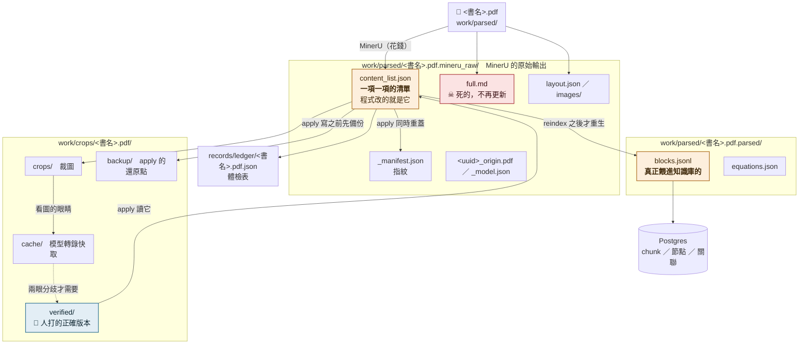

# 一份文件的檔案地圖

**這張圖回答一個問題：改的到底是哪個檔，以及為什麼改了它別的地方沒跟著變。**

⚠ 這張圖是**檔案層**的。流程層看 [pipeline.md](pipeline.md)，
機器層看 [data-locations.md](data-locations.md)。

---

## 一、⚠ 先講最會咬人的一條：`full.md` 是死的

實測時間戳（`N Flow Acoustics.pdf`，2026-08-16 量）：

```
Aug  9 21:40   <書名>.pdf                    原始 PDF
Aug  9 21:42   full.md                       ← 從此沒有再更新過
Aug  9 21:42   layout.json / images/
Aug 16 00:53   content_list.json             ← 當天 apply 改的
Aug 16 00:53   _manifest.json                ← 同時重蓋指紋
Aug 16 00:53   work/crops/<書名>/backup/     ← apply 的還原點
Aug 16 00:55   .parsed/*.blocks.jsonl        ← 兩分鐘後，reindex 觸發重生
```

**`full.md` 停在最初解析那一刻，之後所有的修補都不會進去。**

⚠ 後果：拿 `full.md` 去確認內容會得到**修補前的答案**。
2026-08-16 實測踩到 —— grep `full.md` 得到 923 處符號誤讀，
而知識庫裡實際只有 5 處。**差了 180 倍，而且方向是「以為壞得很嚴重」。**

⇒ **要確認內容，去查資料庫或 `content_list.json`，不要看 `full.md`。**

---

## 二、全景



> 🟠 動它會改變 AI 讀到的東西　🔵 人打的　🔴 **死的，不要相信它**

---

## 三、逐檔：這是什麼、誰改它、清空重來後還在嗎

| 檔案 | 是什麼 | 誰會改它 | 重解析後 |
|---|---|---|---|
| `<書名>.pdf` | 原始檔 | 沒有人 | 還在 |
| **`content_list.json`** | **一項一項的清單。AI 讀到的內容就是它** | `apply`（消音／人工裁定／機械修補） | **重生，修補全沒** |
| `_manifest.json` | 指紋。決定快取算不算有效 | `apply` 的 `restamp_manifest()`（唯一擁有者） | 重生 |
| `full.md` | ☠ 最初解析的整份文字 | **沒有人。永遠停在第一次** | 重生 |
| `layout.json`／`images/` | 版面座標與裁出來的圖 | 沒有人 | 重生 |
| **`blocks.jsonl`** | **真正送進知識庫的那一份** | `reindex` 時重生 | 重生 |
| **`verified/`** | 👤 **人看原圖打的正確版本** | 只有人 | **不會重生。這是唯一不可再生的** |
| `crops/` | 裁圖 | 自動 | 重裁，免費 |
| `cache/` | 看圖模型的轉錄輸出 | 自動 | **重跑要錢** |
| `backup/` | `apply` 寫之前的還原點 | `apply` | 不需要 |
| `ledger/<書名>.json` | 體檢表（`note` 是人寫的理由） | 部分自動、部分人手填 | **不會重生** |
| Postgres | chunk／節點／關聯 | `reindex` 或重抽 | **重抽要錢，沒有 undo** |

---

## 四、三條最容易搞混的因果

**一、改了 `content_list.json`，知識庫不會跟著變。**
已索引的文件在掃描時會被直接跳過。要生效只有 `reindex`：刪掉文件記錄再重掃。
實測就是那兩分鐘的落差（00:53 改、00:55 才重生 `blocks.jsonl`）。

**二、改了 `content_list.json` 不重蓋指紋，修補會被洗掉。**
指紋對不上 → 系統判定這份快取壞了 → 重新解析 → 蓋掉你的修補。
2026-08-13 出過這個事故。⇒ **只能透過 `apply` 改，不要自己寫那個檔。**

**三、`verified/` 的檔名是「清單裡的第幾項」。**
所以重新解析一次之後，那些編號**可能指到別的項目**。
⇒ 套用之前一定要逐檔驗「指得到、型別對、頁碼對」。2026-08-16 做過一次，
173 個全數通過才動。

---

## 五、可信度

| 部分 | 依據 |
|---|---|
| 檔案清單與時間戳 | 2026-08-16 在 dker 實跑 `ls -la`，取 `N Flow Acoustics.pdf` |
| `full.md` 不更新 | 同上時間戳 ＋ 當天 grep 它得 923 處、查資料庫得 5 處 |
| `content_list` → `blocks.jsonl` 的先後 | 同上時間戳（00:53 → 00:55） |
| 誰改哪個檔 | 讀 `pp/apply.py`、`postprocess.py` 的實作 |
| 「重解析後還在嗎」那一欄 | 部分實測（08-09 清空重來過），部分依 `verdicts/README.md` |
| ⚠ `blocks.jsonl` 是不是**唯一**的餵入來源 | **沒有逐步追過**。只確認它在 `content_list` 之後重生、而且內容進得了知識庫 |

> **PO 批註區：**
>
> （寫在這裡）
