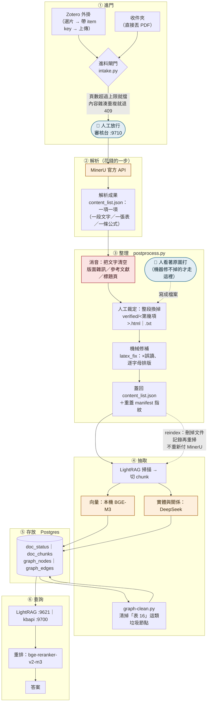

# 管線 — 一份 PDF 從進門到被查詢

**這張圖回答一個問題：一份 PDF 進來之後，到底發生了什麼。**

⚠ **圖上刻意沒有任何數字。** 份數、項數、字元數都會變，寫死的那一版撐不過一週。
要數字跑 [handoff-20260816.md](../docs/handoff-20260816.md) 裡的指令。

⚠ **這張圖畫的是「現在跑著的」，不是「設計上應該的」。** 兩者不一樣的地方
用虛線與註記標出來了。

---

## 全景



> 顏色的意思：🔵 人要出場　🟠 這一步要花錢　🔴 **這一步會把文字刪掉**

---

## 每一關到底動了什麼

| 關卡 | 動的是什麼 | 花錢嗎 | 可逆嗎 |
|---|---|---|---|
| ① 進門 | 只是搬檔案與擋下不該進的 | 否 | 是 |
| ② 解析 | PDF → 一項一項的清單 | **是（MinerU 額度）** | 快取還在就不必重跑 |
| ③ 整理 · 消音 | **把文字清空**（原文存進備份欄位） | 否 | 是，`revert` 讀得回來 |
| ③ 整理 · 人工裁定 | **整段換掉**（原值存進備份欄位） | 否 | 是，同上 |
| ③ 整理 · 機械修補 | 就地正規化 | 否 | 是 |
| ④ 抽取 | 切塊、算向量、抽實體與關係 | **是（DeepSeek）** | 只能重抽，沒有 undo |
| ⑤ 存放 | 寫進資料庫 | 否 | **刪節點沒有 undo** —— 所以 `graph-clean` 每次都存備份 |
| ⑥ 查詢 | 唯讀 | 每次查詢的 LLM 費用 | — |

### ⚠ 三件最容易搞混的事

**一、「改」和「刪」是兩件事，發生在同一關。**

```
消音      把文字清空        → 那段話永遠不會出現在答案裡，而且沒有訊號
人工裁定  把文字換成正確的  → 內容還在，只是換了一版
```

兩者都把原值存進 `_pp_original_*`，所以都還原得回來。
**但刪比改危險**：改錯了內容不對還看得出來，刪掉了你不會知道少了一塊。

**二、改了第 ③ 關，第 ⑤ 關不會自己更新。**

解析成果改了 ≠ 知識庫裡的文字改了。已索引的文件在掃描時會被直接跳過，
**唯一的辦法是 `reindex`：刪掉文件記錄再重掃**（圖上那條虛線）。
PDF 與 AI 快取都留著，所以**不會重新付 MinerU**，沒改到的段落也直接命中快取。

**三、每重抽一次，第 ④ 關就可能生出新的垃圾節點。**

模型會把「表 16」當成一個獨立概念抽出來。提示詞守不住（實測三次），
所以靠 `graph-clean.py` 在容器外用樣式掃掉。
⚠ **但沒有任何東西規定「重抽之後要跑它」** —— 2026-08-16 實測：重抽兩份文件
就帶回三個垃圾節點，是人工發現的。

---

## 人在哪裡出現


| 出場 | 頻率 | 現在的做法 |
|---|---|---|
| 放行 | 每一批 | 審核台按一下 |
| 看圖打字 | 只在機器修不掉時 | 存成 `verified/<第幾項>.html｜.txt` |
| 裁定版本 | 罕見 | ⚠ **目前沒有畫面可以比對**，只能讀 HTML 原始碼 |
| 決定判準 | 一次性 | 寫成 `docs/decisions/` 的 ADR |

---

## 這張圖沒畫什麼

- **看圖的模型（三隻眼）** 怎麼互相比對、什麼時候叫第三隻 —— 那是另一張圖
- ✅ **檢查站站在哪裡** —— 已經畫了：[who-guards-what.md](who-guards-what.md)
- **東西存在哪台機器上**、哪些進版控 —— 那是第二張圖
- **重建（藍綠切換）的流程** —— 設計還沒批准，畫了會變

---

## 這張圖的可信度

| 部分 | 依據 |
|---|---|
| ①②③ 的順序與各關動什麼 | 2026-08-16 實跑 `postprocess.py plan／apply／reindex` 逐步看輸出 |
| `reindex` 不重付 MinerU | 同日實跑，零 MinerU 呼叫、總份數不變 |
| 消音三條規則的分工 | 讀 `pp/rules/` 三個檔的判準原文 |
| 重抽會帶回垃圾節點 | 同日實測，`compat-check` 的 A-33 從綠變紅 |
| ④⑤⑥ 的模型與服務 | `CLAUDE.md` 的外部服務表 ＋ `compat-check` 當日輸出 |
| 進料閘門的細節 | 讀 `intake.py`，**沒有實跑過一次完整進料** |

> **PO 批註區：**
>
> （畫法能不能討論、哪裡畫錯了、要不要補另外兩張——寫在這裡）
