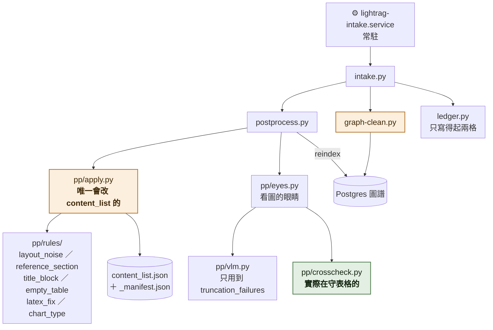
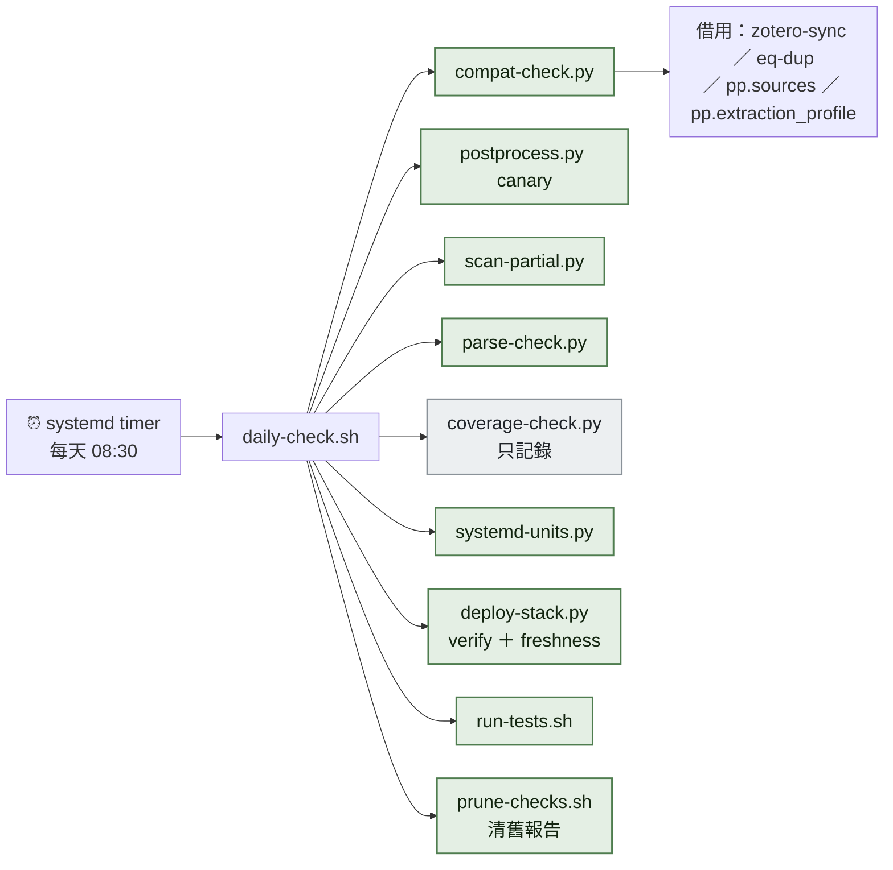

# 腳本地圖

**這張圖回答一個問題：這支腳本是誰在叫它，它會動到什麼。**

⚠ 「誰在守什麼、擋不擋流程」看 [who-guards-what.md](who-guards-what.md)，
那張圖回答的是**判斷**；這張回答的是**接線**。
一份文件的檔案結構看 [document-files.md](document-files.md)。

---

## 一、動資料的那一條線

只有這一條會改東西。其餘全是唯讀。



⚠ **`pp/vlm.py` 只有 `truncation_failures` 被用到。** 那個檔裡的 `judge()`
（十二道閘門）零生產呼叫點 —— 圖上刻意不畫它，因為畫了就是在說謊。

---

## 二、每天自己會跑的



**`compat-check.py` 是個轉運站** —— 它自己不做事，是把別的腳本的函式庫 import
進來當檢查項（A-35 用 `pp/sources.py`、A-37 用 `eq-dup`、A-38 用 `zotero-sync`）。
⚠ **所以那幾支「有沒有人叫」要分兩層看**：CLI 沒人叫，但它的函式庫每天在跑。

---

## 三、提交時會跑的

```
pre-commit
├─ conventional-pre-commit   擋 commit 訊息格式
├─ doc-discipline            只跑三支測試（LOG 新鮮度／NEXT 完成率／死連結）
├─ ruff check                lint，**沒有 formatter**（本庫靠對齊傳達資訊）
└─ gitleaks                  ☠ 註解掉，沒啟用
```

另外 `guard-command.py` 掛在這個 AI 開發環境的指令攔截點上，**每次跑指令都會過它**。
⇒ 整份地圖裡**只有它會擋下動作**，其餘全部只會叫。

---

## 四、沒有人叫的

```
extract-check.py      抽取接地檢查    刻意不排程（跑一次一個多小時）
standards-check.py    上位規範        文件自己記著「不在每日排程裡」
eq-check.py           方程式三方比對  自陳是診斷工具
graph-shape.py        量圖譜形狀
context-budget.py     查詢的 token 花到哪
retrieval-check.py    消噪對檢索有沒有效
retrieval-score.py    兩座庫的檢索評分比較
entity-merge.py       實體碎片化排序
symbol-hits.py        符號型實體佔位
eq-label.py           人工標註（A-37 的錯誤訊息叫人去跑，自己不跑）
```

⚠ **有幾支是刻意的手動工具，但沒有任何標記，分不出「刻意」和「忘了接」。**
每次都要重新 grep 一次才知道。

⚠ 而且守衛只守單向：`test_no_dead_script_refs.py` 會抓
「文件提到不存在的腳本」，**反方向（存在的腳本沒人叫）完全沒有人守**。

---

## 五、可信度

| 部分 | 依據 |
|---|---|
| daily-check 跑哪幾支、順序 | 逐行讀 `daily-check.sh`，附行號 |
| timer 真的在跑 | dker 實測 `systemctl list-timers`／`is-enabled` |
| `judge()` 零呼叫點 | 整包 grep，追到 `檔案:行號` |
| 零呼叫點清單 | 同上，涵蓋 `scripts/`／`tests/`／`.pre-commit-config.yaml`／`compose.yaml` |
| pre-commit 的四個 hook | 讀 `.pre-commit-config.yaml` |
| `intake.py` 呼叫 `graph-clean` 與 `ledger` | 讀原始碼，**沒有實跑過一次完整進料** |
| ⚠ 那十支腳本本身還跑不跑得動 | **沒驗**。只查了「有沒有人叫它」 |

> **PO 批註區：**
>
> （寫在這裡）
