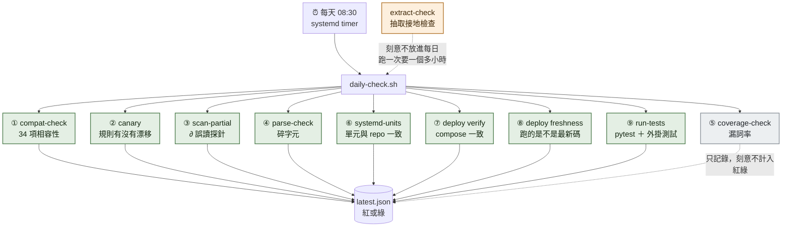
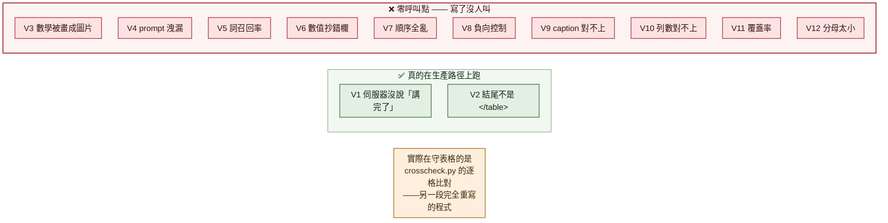

# 誰在守什麼

**這張圖回答一個問題：這個紅燈該不該信，以及有沒有東西其實沒人在守。**

⚠ **這張圖最重要的不是「有哪些檢查」，是「哪些寫了但沒人叫」。**
「寫好的檢查沒被呼叫等於沒寫」是這個專案反覆踩到的形狀，這張圖把它攤開。

---

## 一句話結論（三個，都不太好看）

```
一、十二道閘門，實際只有兩道在跑。另外十道零呼叫點
二、體檢表八格，只有兩格會自動填。四格根本沒有任何程式會寫
三、上面所有的檢查，沒有一支會擋住文件進知識庫 —— 它們只會讓早上的報告變紅
```

---

## 二、每天早上實際跑什麼

`lightrag-daily-check.timer` 每天 **08:30** 觸發（dker 實測 `enabled` 且 `active`）。
照順序跑九樣，結果寫進 `/data/lightrag/checks/latest.json`。



**今天（2026-08-16 08:30）的實際結果**，原文照抄：

```json
{"at":"20260816T083013","status":"fail","commit":"8c16985",
 "compat_rc":5,"scan_rc":0,"units_rc":0,"deploy_rc":0,
 "fresh_rc":2,"tests_rc":3,"parse_rc":1,"coverage_rc":1}
```

| 紅燈 | 意思 | 該不該信 |
|---|---|---|
| `compat_rc=5` | compat-check 有 soft 失敗 | **信**。今天是 A-35（58 份沒登記來源）與 A-38（缺 Zotero 金鑰沒跑） |
| `fresh_rc=2` | 跑著的不是最新碼 | ⚠ **沒追原因**。dker 的 repo 停在 8/15，coder 已經領先 22 個 commit |
| `tests_rc=3` | 測試失敗 | **不完全信**。dker 沒有 node，外掛的測試在那台跑不起來，天天紅 |
| `parse_rc=1` | 有文件被判 ERROR | **信**。今天是 2 份 |
| `coverage_rc=1` | 有文件漏詞超標 | **刻意不計入紅綠** —— 假訊號太多（見 ADR-0007） |

---

## 三、⚠ 十二道閘門：兩道在跑，十道沒人叫

`pp/vlm.py` 的 `judge()` 定義了十二道閘門來守表格轉錄品質。



**為什麼 V1／V2 活著**：它們被抽成一個共用函式，看圖那條路直接呼叫它。
**為什麼 V3–V12 死著**：`judge()` 這個函式**整包只有測試在呼叫**，生產路徑零呼叫。

⚠ **而且它們守的東西跟現在實際在守的不一樣。**
`crosscheck.py` 比對的是「兩雙眼睛互相同不同意」；
十二道閘門原本要驗的是「轉錄符不符合原文」。**那是兩個不同的問題。**

⚠ **同一個形狀還有一個**：`pp/judge.py` 的表格裁判，
`ask()`／`negative_control()`／`jaccard()` 三個函式**全部零呼叫點**。
只有它抽出來的底層 `ask_json()` 被方程式那條路借去用了。

---

## 四、⚠ 體檢表八格，四格根本沒有寫手

每份文件一張三態表（過／不過／驗不了）。誰在填：

| 格子 | 誰填 | 頻率 |
|---|---|---|
| `pp.preflight` | ✅ 進料程式自動寫 | 每次進料 |
| `pp.tables` | ✅ 進料程式自動寫 | 每次進料 |
| `pp.equations` | 🟡 一次性回填工具 | 人手動跑 |
| `extract.grounding` | 🟡 一次性回填工具（還要先手動跑另一支） | 人手動跑 |
| `parse.coverage` | ❌ **沒有任何程式會寫它** | — |
| `parse.checks` | ❌ **沒有任何程式會寫它** | — |
| `extract.format` | ❌ **沒有任何程式會寫它** | — |
| `retrieval.smoke` | ❌ **沒有任何程式會寫它** | — |

進料程式自己的註解寫著：**「沒跑過的閘門填 `pass` 就是說謊」** —— 所以那六格留空是
誠實，不是漏掉。但代價是**體檢表有四格永遠是空的**。

⇒ [ADR-0007](../docs/decisions/0007-parse-gate-thresholds.md) 剛把
`parse.coverage` 與 `parse.checks` 的判準定了，**但接線還沒做**，所以那兩格還是空的。

---

## 五、⚠ 沒有一支檢查會擋住文件進知識庫

這是最容易誤會的一點。

```
每日的九樣檢查   →  只會讓早上的報告變紅。文件照樣進庫
真正會擋的是     →  進料自己的預檢，與寫入時的護欄
```

**兩者是完全分開的機制。** 早上看到綠燈，不代表昨天進來的文件被檢查過；
看到紅燈，也不代表有東西被擋下來。

---

## 六、零呼叫點的腳本清單

寫好了、還在 repo 裡、**沒有任何東西會呼叫它**：

```
extract-check.py       抽取接地檢查（刻意不排程，跑一次一個多小時）
standards-check.py     有沒有照上位規範做（文件自己記著「不在每日排程裡」）
eq-check.py            方程式三方比對（自陳是診斷工具）
graph-shape.py         量圖譜形狀
context-budget.py      查詢的 token 花到哪
retrieval-check.py     消噪對檢索有沒有效果
retrieval-score.py     兩座庫的檢索評分比較
entity-merge.py        實體碎片化排序
symbol-hits.py         符號型實體佔位
eq-label.py            人工標註（錯誤訊息叫人去跑，自己不跑）
```

⚠ **這不全是壞事** —— 有幾支是刻意的手動工具（`extract-check` 太慢、
`eq-label` 本來就要人）。但**分不出「刻意手動」與「忘了接」的東西沒有標記**，
所以每次都要重新 grep 一次才知道。

⚠ **而且守衛只守單向**：`test_no_dead_script_refs.py` 會抓「文件提到不存在的腳本」，
**但反方向沒有人守** —— 「存在的腳本沒有任何人呼叫」完全沒有自動化。
那份測試自己的註解就承認：曾經有一支腳本差點被當孤兒刪掉，靠手動 grep 才發現。

---

## 七、唯一真的會擋下動作的東西

`guard-command.py` —— 掛在這個 AI 開發環境的指令攔截點上，
每次要跑指令都會先過它，攔到危險形狀就**直接擋掉**（例如把秘密整包輸出、
直接讀 `.env`）。

⇒ **整份清單裡，只有這一支是「擋」，其餘全部是「叫」。**

---

## 八、這張圖沒畫什麼

- **進料自己的預檢與寫入護欄**（真正會擋文件的那一組）—— 那是第四張圖
- **三隻眼睛怎麼互相比對** —— 同上
- 每一支檢查的判準細節 —— 看各自的原始碼

---

## 九、這張圖的可信度

| 部分 | 依據 |
|---|---|
| 每日跑哪九樣、順序、哪些計入紅綠 | 逐行讀 `daily-check.sh`，附行號 |
| timer 真的在跑 | dker 實測 `systemctl list-timers`／`is-enabled` |
| 今天的紅綠結果 | dker 上 `latest.json` 原文 |
| V1–V12 哪些有呼叫點 | 整包 grep，逐道追到 `檔案:行號` |
| `judge.py` 三個函式零呼叫點 | 同上，且與 `docs/NEXT.md` 既有記錄吻合 |
| 體檢表八格誰在填 | 讀 `intake.py`／`ledger-backfill.py`，附行號 |
| compat-check 共 34 項 | **讀原始碼數的，沒有實跑** |
| `fresh_rc=2` 的原因 | ❌ **沒查**。只確認 dker 的 repo 落後 coder 22 個 commit |
| 零呼叫點的腳本本身還能不能跑 | ❌ **沒驗**。只查了「有沒有人叫它」 |
| compat-check 缺 A-04／08／09／12／15 | **查不到原因**，不確定是刪掉還是保留 |

> **PO 批註區：**
>
> （寫在這裡）
