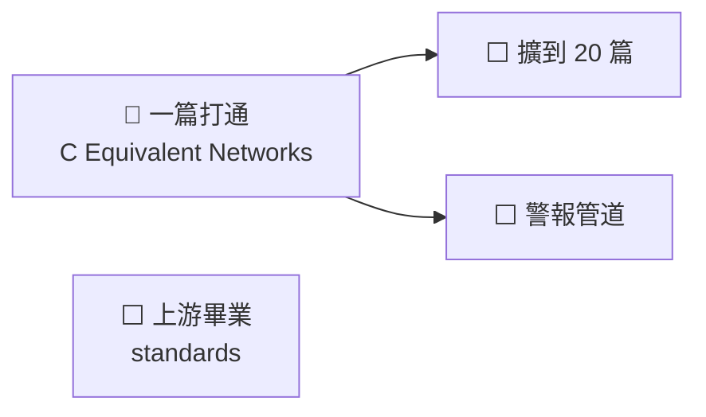

# NEXT — 接下來做什麼

**做完的項目刪整行，摘要進 [cairn/LOG.md](../cairn/LOG.md)**（BASELINE done 項紀律）。
`tests/test_next_done_ratio.py` 在完成行數追上待辦行數時會紅——那就是該掃的時候。

狀態 legend：`✅完成 / 🔵進行中 / ⬜未起 / ⏸暫停 / ⚠️卡住`

## 狀態總表

| 線 | 狀態 | 卡在哪 |
|---|---|---|
| 一篇打通 | 🔵 | 下一步。第一件事是驗映像支不支援 `PGTableGraphStorage` |
| 上游畢業 | ⬜ | 三條候選，影響所有專案，另開一輪 |
| 擴到 20 篇 | ⬜ | 等一篇打通 |
| 警報管道 | ⬜ | 等一篇打通；先決定走哪裡再 enable 排程 |

需求與設計、規則執行者、沉澱知識、清理 coder 四條已於 2026-08-07 收線，
經過見 [cairn/LOG.md](../cairn/LOG.md)。

## 進度圖

## 🔵 一篇打通（設計見 [docs/rebuild-design.md](rebuild-design.md)）

- 🔵 寫 deploy 動作把 compose 複製到 `/opt/stacks/lightrag/`（比照 `systemd-units.py
  install`），並加「兩邊 sha256 相同」的斷言。**現在那份是手動複製的，沒有東西守它**
- ⬜ 解析 `C Equivalent Networks.pdf`（`is_ocr=true`、`pipeline`），量基準數字
- ⬜ 10 張人工裁定的表按頁碼對位；對不上的明確報出來，不猜
- ⬜ 入庫，驗**關係數不是 0**；接上 `scripts/extract-check.py` 量實體名的接地率
- ⬜ 三個 skill 的端點逐一打過（skill 住 `AI_TOOLS`，不在本 repo）

## ⬜ 上游畢業（standards，影響所有專案）

- ⬜ `test_next_done_ratio.py` 進 `PROJECT_TEMPLATE/`——BASELINE 要求每條規則有執行者，
  卻**沒出貨任何執行者給專案**，範本只有文件範本沒有檢查範本
- ⬜ 「不可再生／唯一副本」這類**描述性標籤**也要有執行者。BASELINE 的「規則的執行者」
  那節只管規則，而標籤寫錯會安靜地扭曲後面每個決策
- ⬜ **黑名單不是驗證器**。上游 `self-check.py` 的 `dead_refs` 只認三個寫死的樣式，
  所以 README 說 `scripts/` 有 `scan_projects`／`compact_logs`／`test_smoke`（都不存在）
  它還是回報「乾淨」

## ⏸ 暫緩

- ⏸ **`:9621` 要不要對外關掉。** PO 當初做 kbapi 的主要動機就是「只開一個埠」，
  但 9621 一直也開著，目標沒達成。2026-08-07 決定暫時保留——LightRAG 的 WebUI
  有圖譜瀏覽器，對「拓展想法」可能有用。關掉的做法是把 `BIND_ADDR` 那半改成
  `127.0.0.1`（dker 本機腳本照跑，Tailscale 上看不到），不需要改任何腳本

## ⬜ 之後

- ⬜ 擴到 20 篇；入庫自動化（`intake.py` 那套狀態機對新架構還成不成立未驗）
- ⬜ 警報管道**先決定走哪裡，再**把排程重新 enable。一個沒人看的紅燈等於沒有檢查
- ⬜ 重跑 `systemd-units.py install`——`/etc` 裡還是舊版（含已刪除的 OnFailure 備援）
- ⬜ 接上 `scripts/pp/oracle.py` 的 `mineru_options()`（現在全 repo 零呼叫端），
  接上之後 `rebuild-checklist.md` A 節那六條就有執行者
- ⚠️ **MinerU API token 2026-09-04 到期**——到期後解析直接不能跑
