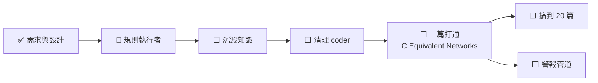

# NEXT — 接下來做什麼

**做完的項目刪整行，摘要進 [cairn/LOG.md](../cairn/LOG.md)**（BASELINE done 項紀律）。
`tests/test_next_done_ratio.py` 在完成行數追上待辦行數時會紅——那就是該掃的時候。

狀態 legend：`✅完成 / 🔵進行中 / ⬜未起 / ⏸暫停 / ⚠️卡住`

## 狀態總表

| 線 | 狀態 | 卡在哪 |
|---|---|---|
| 需求與設計 | ✅ | 裁決在 [docs/rebuild-design.md](rebuild-design.md) |
| 規則執行者 | 🔵 | LOG 檢查已上；done 比例檢查未做 |
| 沉澱知識 | ⬜ | `cairn/<topic>.md` 至今 0 個 |
| 清理 coder | ⬜ | 等 PO 看過清單才動手 |
| 一篇打通 | ⬜ | 前面三線做完才開始 |

## 進度圖

## 🔵 規則執行者

- 🔵 加 `tests/test_next_done_ratio.py`，掛上 pre-commit

## ⬜ 沉澱知識

- ⬜ `cairn/LOG.md` 補這一輪；建第一個 `cairn/<topic>.md`

## ⬜ 清理 coder

- ⬜ 320 個追蹤檔依「重建後還存不存在」過一遍，**先給 PO 清單再動手**
- ⬜ 三個 lightrag skill 從 `AI_TOOLS/skills/common/` 歸位到 repo（現在兩份副本，
  載入的是共用區那份，違反「專案 skill 不放共用區」）
- ⬜ 修掉 skill `description` 宣稱的「20 parsed papers」——那個庫已不存在，
  而 `description` 是強制進上下文的，**每個 session 都被灌一次假前提**

## ⬜ 一篇打通（設計見 [docs/rebuild-design.md](rebuild-design.md)）

- ⬜ 驗證選定映像支援 `PGTableGraphStorage`；不支援就退回 Neo4j 並記進 KNOWN_ISSUES
- ⬜ 解析 `C Equivalent Networks.pdf`（`is_ocr=true`、`pipeline`），量基準數字
- ⬜ 10 張人工裁定的表按頁碼對位；對不上的明確報出來，不猜
- ⬜ 入庫，驗**關係數不是 0**、實體名可在原文找到的比例
- ⬜ 三個 skill 的端點逐一打過

## ⬜ 之後

- ⬜ 警報管道**先決定走哪裡，再**把排程重新 enable。一個沒人看的紅燈等於沒有檢查
- ⬜ 重跑 `systemd-units.py install`——`/etc` 裡還是舊版（含已刪除的 OnFailure 備援）
- ⬜ 接上 `scripts/pp/oracle.py` 的 `mineru_options()`（現在全 repo 零呼叫端），
  接上之後 `rebuild-checklist.md` A 節那六條就有執行者
- ⚠️ **MinerU API token 2026-09-04 到期**——到期後解析直接不能跑
