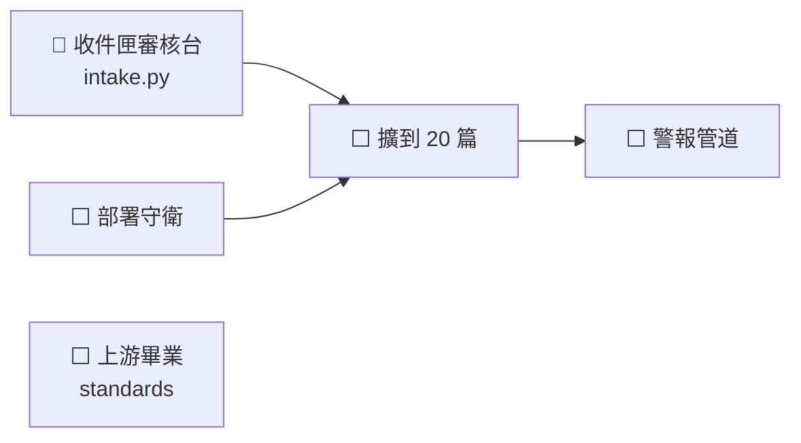

# NEXT — 接下來做什麼

**做完的項目刪整行，摘要進 [cairn/LOG.md](../cairn/LOG.md)**（BASELINE done 項紀律）。
`tests/test_next_done_ratio.py` 在完成行數追上待辦行數時會紅——那就是該掃的時候。

狀態 legend：`✅完成 / 🔵進行中 / ⬜未起 / ⏸暫停 / ⚠️卡住`

## 狀態總表

| 線 | 狀態 | 卡在哪 |
|---|---|---|
| 收件匣審核台 | 🔵 | 下一步。`intake.py` 對新架構還成不成立**未驗** |
| 部署守衛 | ⬜ | stack 的 compose 是手動複製的，沒有東西守它 |
| 擴到 20 篇 | ⬜ | 語料要先挑 |
| 上游畢業 | ⬜ | 三條候選，影響所有專案，另開一輪 |
| 警報管道 | ⬜ | 先決定走哪裡再 enable 排程 |

**一篇打通已完成**（`C Equivalent Networks.pdf`：節點 1,239 / 邊 1,995、裁定 10/10 對得上、
空表 9→1、五個端點全通）。經過見 [cairn/LOG.md](../cairn/LOG.md)。

## 進度圖

## 🔵 收件匣審核台

- 🔵 拿 `tests/test_intake.py`（25 KB，為舊架構寫的）對新架構跑一次，**看它壞在哪**，
  再決定修還是重寫。它是「拖 PDF 進去、看候選狀態走完管線」的介面，而且流程把修補
  排在送進索引之前——正好擋住「拖進 LightRAG WebUI 會跳過後處理」
- ⬜ 接起來之後把埠與 `BIND_ADDR` 比照 kbapi（官方 python 映像 ＋ 掛 scripts，不自建）

## 🔵 讓 dker 能跑測試

- 🔵 **dker 上裝 pytest**（`apt install python3-pytest`）。有一批測試只有在那台跑才有
  意義：`test_deploy_stack` 比對 `/opt/stacks/`、`test_systemd_units` 比對 `/etc`、
  `test_verdicts` 看 `/data`。不裝的代價已經看到——`daily-check` 每天報「測試失敗」，
  而它其實一次都沒跑過。`run-tests.sh` 2026-08-07 已改成明說「驗不了」而不是「失敗」

## ⬜ 上游畢業（standards，影響所有專案）

- ⬜ `test_next_done_ratio.py` 進 `PROJECT_TEMPLATE/`——BASELINE 要求每條規則有執行者，
  卻**沒出貨任何執行者給專案**，範本只有文件範本沒有檢查範本
- ⬜ 「不可再生／唯一副本」這類**描述性標籤**也要有執行者。BASELINE 的「規則的執行者」
  那節只管規則，而標籤寫錯會安靜地扭曲後面每個決策
- ⬜ **黑名單不是驗證器**。上游 `self-check.py` 的 `dead_refs` 只認三個寫死的樣式，
  所以 README 說 `scripts/` 有三支不存在的腳本它還是回報「乾淨」

## ⏸ 暫緩

- ⏸ **`:9621` 要不要對外關掉。** PO 做 kbapi 的主要動機是「只開一個埠」，但 9621 一直
  也開著。2026-08-07 決定暫時保留——WebUI 有圖譜瀏覽器。關法是把 `BIND_ADDR` 那半改成
  `127.0.0.1`，不需要改任何腳本

## ⬜ 之後

- ⬜ 擴到 20 篇（語料要重挑還是照舊，未定）
- ⬜ 警報管道**先決定走哪裡，再**把排程重新 enable。一個沒人看的紅燈等於沒有檢查
- ⬜ 重跑 `systemd-units.py install`——`/etc` 裡還是舊版（含已刪除的 OnFailure 備援）
- ⬜ 接上 `scripts/pp/oracle.py` 的 `mineru_options()`（現在全 repo 零呼叫端），
  接上之後 `rebuild-checklist.md` A 節那六條就有執行者
- ⬜ KI-001 表格結構黏連：掉字 10.6% 裡最大的一族（117 詞）。要解得重排表格結構
- ⚠️ **MinerU API token 2026-09-04 到期**——到期後解析直接不能跑
