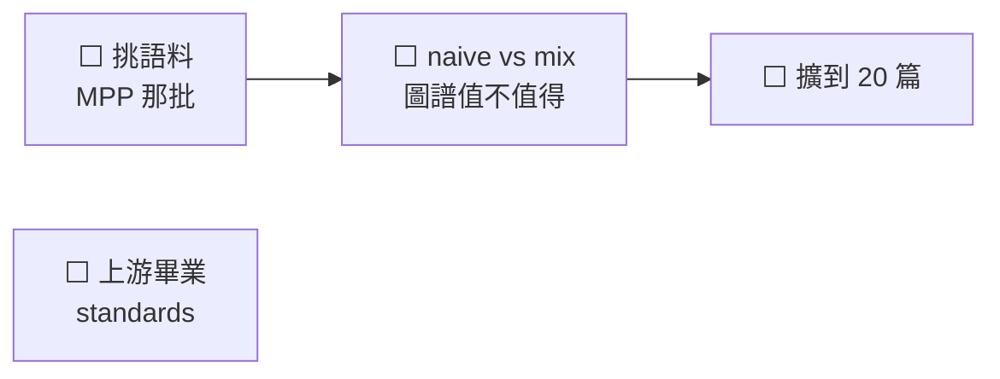

# NEXT — 接下來做什麼

**做完的項目刪整行，摘要進 [cairn/LOG.md](../cairn/LOG.md)**（BASELINE done 項紀律）。
`tests/test_next_done_ratio.py` 在完成行數追上待辦行數時會紅——那就是該掃的時候。

狀態 legend：`✅完成 / 🔵進行中 / ⬜未起 / ⏸暫停 / ⚠️卡住`

## 狀態總表

| 線 | 狀態 | 卡在哪 |
|---|---|---|
| 擴到 20 篇 | ⬜ | 語料要先挑 |
| 上游畢業 | ⬜ | 三條候選，影響所有專案，另開一輪 |

**已收線**：一篇打通（節點 1,239 / 邊 1,995、裁定 10/10、空表 9→1、五端點全通）、
部署守衛、重開機自動復原、收件匣審核台（`:9710`，開機自動起）。
經過見 [cairn/LOG.md](../cairn/LOG.md)。

## 進度圖

## ⬜ 收件匣審核台（已上線，剩尾巴）

- ⬜ 拖一份真的 PDF 進去走完整流程（目前只驗過端點會回應，**沒有真的收過件**）

## ⬜ 服務健康的判準要改

- ⬜ **「容器在跑」不等於「服務可用」。** 2026-08-07 實測踩到：`docker compose ps` 顯示
  `running`、`docker port` 卻是空的，外面完全連不上，而我因此誤判過一次「已救回」。
  現有的檢查沒有一個會發現這個狀態。判準要改成「打得到端點」
- ⬜ 失敗的容器要 `docker compose up -d --force-recreate` 才救得回來，單純 `up -d`
  只是 Starting 它，埠不會綁回來。寫進哪份文件還沒決定

## ⬜ 上游畢業（standards，影響所有專案）

- ⬜ `test_next_done_ratio.py` 進 `PROJECT_TEMPLATE/`——BASELINE 要求每條規則有執行者，
  卻**沒出貨任何執行者給專案**，範本只有文件範本沒有檢查範本
- ⬜ 「不可再生／唯一副本」這類**描述性標籤**也要有執行者。BASELINE 的「規則的執行者」
  那節只管規則，而標籤寫錯會安靜地扭曲後面每個決策
- ⬜ **黑名單不是驗證器**。上游 `self-check.py` 的 `dead_refs` 只認三個寫死的樣式，
  所以 README 說 `scripts/` 有三支不存在的腳本它還是回報「乾淨」

## ⏸ 暫緩

- ⏸ **`:9621` 要不要對外關掉。** PO 做 kbapi 的主要動機是「只開一個埠」，但 9621 一直
  也開著。2026-08-07 決定暫時保留——WebUI 有圖譜瀏覽器。關法是把 `BIND_ADDR` 那半改成
  `127.0.0.1`，不需要改任何腳本

## ⬜ 之後

- ⬜ 擴到 20 篇（語料要重挑還是照舊，未定）
- ⚠️ **`backup-cold.sh` 今天改過 DBS 陣列（拿掉 neo4j）但一次都沒跑過**，
  而 cold-backup 排程已經 enable。第一次自動執行要看結果——它會停容器再啟動
- ⬜ canary 基準還是舊 20 篇的。語料定下來之後跑 `postprocess.py canary --update`，
  並在 commit 說明每個數字為什麼變
- ⬜ 把 `oracle.mineru_options()` 接成**自動斷言**。2026-08-08 手動呼叫過、確認容器
  實際用的是 `is_ocr=True`／`model_version=pipeline`，但那是人跑的——
  `rebuild-checklist.md` A 節那六條仍然沒有執行者
- ⬜ KI-001 表格結構黏連：掉字 10.6% 裡最大的一族（117 詞）。要解得重排表格結構
- ⚠️ **MinerU API token 2026-09-04 到期**——到期後解析直接不能跑
