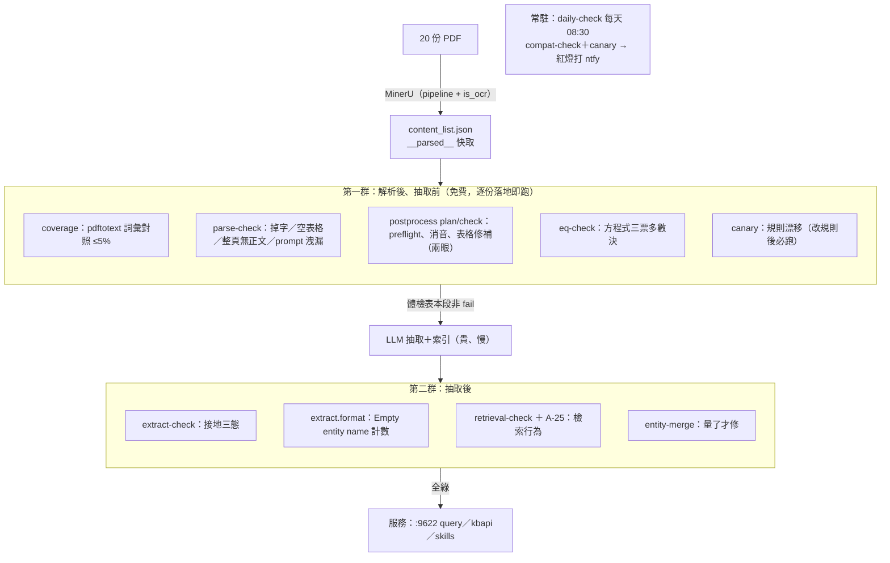

# 乾淨重建：acoustics_v2

2026-08-02 定案。目標：把原 20 份 PDF 在新 workspace 重新走一遍完整流程，
**每一段的閘門在該段結束時立刻跑、全綠才進下一段**——不是索引完再回頭補檢查。

三個已定的決策：

1. **範圍：20 份**（原 acoustics_v155 那 20 份）。每個數字都有舊值可對照，
   整條流程本身就是迴歸測試。390 份全量擴充另議。
2. **警報：自架 ntfy**（`/opt/stacks/ntfy`，:9800）。email 被否決的理由：這個專案的
   警報沒有可遠端決策的內容——紅燈＝來終端機查；回信決策要多養一個收信解析服務。
3. **acoustics_v155 凍結當對照組**：繼續服務查詢（:9621/:9700），不再寫入，
   新庫驗收後退役。凍結＝該 checkout 與該容器不再改動。

## 分工

- **規劃／文檔／驗收**：主線（Fable）。工單寫清楚：讀哪些文檔、約束、驗收條件。
- **執行**（部署、改程式、跑流程）：一律開 Opus 子代理。
- 節奏：出工單 → Opus 執行 → 主線親自重跑驗收、更新體檢表與文檔。
  執行者的「自稱完成」不算數，驗收要獨立重跑。

## 帶走什麼、不帶走什麼

「乾淨重建」不帶走**資料**：已修補的 content_list、合併過的實體、現有索引。
全部帶走**用錢和時間換來的結論**：設定（`pipeline+is_ocr`、
`ENTITY_EXTRACTION_USE_JSON`、3-large@3072、`MAX_ASYNC=2`）、全部 scripts/、
六條鐵則、judgement-flow 的程序、已驗證的偵測器與已知誤判清單。

## 為什麼結構長這樣

上次的根本問題：檢查是資料進索引**之後**才補的。pdftotext 免費、全覆蓋、
直接對應解析段，卻在全部索引完的 8/2 才第一次跑，一跑就抓到全庫最大的洞
（C 漏詞 15.2%）。對照源與閘門的推導見 [judgement-flow.md](judgement-flow.md)
第 0 節——本檔只記「什麼時候跑什麼」。

三個結構性決定：

1. **閘門前置**：解析一結束就驗解析（MinerU 快取落地即可驗，不等抽取）。
2. **每份文件一張三態體檢表**（格式見下）：接手的人看表，不翻 commit。
3. **排程第一天就裝**：`lightrag-daily-check.timer` 每天 08:30 跑
   compat-check + canary，失敗打 ntfy。「誰會報錯」不再是「沒有人」。

## 檢查跑在哪裡：兩群腳本＋一個常駐

分界就是**貴的那一步**（LLM 抽取）：抽取前的檢查全免費、可無限重跑，所以
全部驗完才讓 LLM 上工；抽取後的檢查驗的是 LLM 的產出。另有每日 timer 常駐，
與階段無關。



`compat-check` 跨兩群：契約層 15 項隨時可跑（`--no-docs`），資料層每份 6 項
在解析產物存在後就有效。

## 檢查跑在哪裡：兩群腳本＋一個常駐

分界就是**貴的那一步**（LLM 抽取）：抽取前的檢查全免費、可無限重跑，所以
全部驗完才讓 LLM 上工；抽取後的檢查驗的是 LLM 的產出。另有每日 timer 常駐，
與階段無關。


`compat-check` 跨兩群：契約層 15 項隨時可跑（`--no-docs`），資料層每份 6 項
在解析產物存在後就有效。

## 階段與閘門

### 階段 0：環境 —— 進行中

- [x] ntfy stack（digest 釘死）＋ `scripts/notify.sh` ＋ `scripts/daily-check.sh`
- [x] systemd timer（`SuccessExitStatus=1`：exit 1＝檢查紅燈、腳本已自行通知；
      其他非零＝腳本掛掉，走 `OnFailure=` 備援——備援刻意用獨立 curl 不經
      notify.sh，因為 notify.sh 可能正是故障點）
- [x] 兩條通知路徑實測會響；狀態落地 `/data/rag/lightrag/checks/`（2026-08-02）
- [x] 手機 ntfy 訂閱並確認收到訊息（使用者確認 2026-08-02）
- [x] **v2 stack**（Opus 執行 2026-08-02）：git worktree
      `~/ghq/github.com/neknufelet/lightrag-v2`（分支 `rebuild/acoustics-v2`）、
      dockge bind mount `lightrag-v2`。`WORKSPACE=acoustics_v2`、埠 9622；
      kbapi 以 `profiles` 停用——compose 裡 9700 是寫死的、被 v155 佔用，
      階段 5 恢復時處理。v155 stack 與容器未動。
- [x] **腳本去掉 v155 寫死值**（Opus 執行 2026-08-02）：容器名收斂到
      `pp/oracle.py` 的 `container_for()` 單一推導處；`compat-check --port`
      一併改讀容器內 `PORT` 而非 `HOST_PORT`（A-19 是在容器內打 localhost，
      v155 兩埠同值把這個混用藏了一路，v2 換埠才炸——且炸出的訊息指向錯誤
      方向：「pipeline 不 idle」實際是連不上）。v1 行為實測不變。
- [ ] daily-check 加跑 v2 checkout——**前置條件：A-25 先三態化**（見下），
      否則空 workspace 每天假紅燈，把「警報＝要看」訓練壞
- [ ] **A-25 三態化**（→ Opus，併入階段 1 工單）：空 workspace 的 chunk 數
      恆 0，斷言的 `b > a` 結構性不可能成立。要加「母體是否足以驗它」的
      前置判斷，回「驗不了」而非 FAIL——這是第一個在空母體上結構性驗不了
      的斷言
- [ ] **`__pycache__` 出版控**（→ Opus，併入階段 1 工單）：.pyc 進了版控，
      每次跑腳本都留二進位 diff 噪音
- 驗收紀錄（主線獨立重跑，2026-08-02）：v2 容器 healthy、`:9622/health`
  200 且 `/documents` 為空（庫確實乾淨、認證有效）；worktree
  `compat-check --no-docs` hard 0／soft 1（僅 A-25，空母體驗不了）；
  v155 兩容器 StartedAt 逐奈秒未變、Restarts 0；v1 checkout compat
  135 項與 canary 全綠。7 支腳本 diff 逐一看過。

**階段 0 學到的事**（原始回報在當次工單）：

- 「workspace」有兩個獨立消費者：**路徑**與**容器名／服務位址**。腳本普遍把
  前者做對（讀 .env）、把後者寫死——單一 checkout 時代這個 bug 不可觀測，
  開第二個 worktree 的那一刻全部同時引爆。修法是收斂到單一推導處
  （`container_for()`），不是每支各自 f-string。
- 容器內埠與宿主埠要在**變數名**上分得開。`--port` 這名字沒說是哪個，
  v155 兩者同值時混用無法被發現，換埠當天炸出的錯誤訊息還指向別處。
- compose 裡「插值的埠」與「寫死的埠」混用＝隱形的單例限制。README
  「複製本目錄即可跑第二個」對 kbapi（寫死 9700）不成立。
- bind mount 的宿主目錄要先以宿主使用者建好——讓 docker 自動建會是
  root:root，宿主端腳本寫入時才在半路炸出 permission denied。

### 階段 1：解析（只解析不抽取）

`parse-only.py` 跑 20 份。**每份 content_list 落地即跑**、寫入體檢表：

| 閘門 | 內容 | 門檻／依據 |
|---|---|---|
| `parse.coverage` | pdftotext vs content_list 全文字欄位，≥4 字母英文詞 | ≤5%（舊 20 份中 18 份 ≤5%；C 15.2%、N Flow 8.7%、41598 7.0% 都是它抓的） |
| `parse.checks` | 掉字（`\y` 偵測器、先剔數學式）、空表格（剝標籤）、整頁無正文、prompt 洩漏 | parse-check.py 現行 ERROR 判準 |

超標→停在本段查原因，不往下走。`__parsed__` 在 `/data/rag` 下，涵蓋於既有
restic 備份範圍。

**階段 1 完成（2026-08-02，主線驗收）：**

- 20 份解析完成。parse-only 回報的「失敗 2」是假訊息——Oracle 的 120 秒
  `docker exec` 逾時只殺客戶端，容器內照樣成功寫出有效 bundle；照它重跑會
  白付一次 MinerU。已加 `--timeout`（預設 1800）。
- **coverage 偵測器先考 v155 舊卷**：19/20 份到小數點重現；唯一差異
  C 16.1% vs 15.2%（+0.9pp）完全歸因於 v155 已被兩眼修補的 6 張表。
  驗偵測器過程抓到偵測器自己的 bug：pdftotext 吐合字 `fl`（U+FB02）而
  MinerU 吐 ASCII `fl`，N Flow 被誤量成 10.1%；NFKC 正規化後 8.7% 對上。
- **閘門第一次真的攔下東西**：C 16.1%、N Flow 8.7%、41598 7.0% 記 fail，
  與 v155 同三份，不得進抽取——修補屬階段 2。C 另有 p64 mangled×1
  （README 已知的 1/209）。
- A-25 三態化雙邊驗證：空 v2 回「驗不了＋原因」且 EXIT=0；對 v155 母體
  仍真實驗（2→2、8→8）。daily-check 擴到 v2 後全流程 45 秒雙庫綠。
- v155 全部 2,780 條路徑 mtime 無變化，容器 StartedAt 逐奈秒未動。

**階段 1 學到的事：**

- **pdftotext 對照類比對必先 NFKC 正規化**——合字 vs ASCII 字對長得就像
  掉字，假訊號大（單份 1.4pp）且完全可信。
- **Oracle 的 timeout 是探針預算，不是工作預算。** `docker exec` 逾時
  只殺客戶端，工作照常成功——工具印出的「失敗」是最貴的那種錯誤訊息，
  因為照著它重試要再花錢。
- **容器會以 root 建 `__parsed__`，即使父目錄已由宿主使用者建好。**
  階段 0 的教訓要重述成「路徑上的每一層」，不只 bind mount 根。
- **MinerU 同選項重解析 19/20 份到小數點重現**——未來 coverage 漂移是
  真訊號，不是解析雜訊。
- **v155 的 content_list 是後處理過的**（520 消音、184 chart→image、
  6 表修補），不是 raw-parse 基準；任何對它的比對要說明用的是哪個狀態。

### 階段 2：後處理與修補（索引之前）

- preflight 擋下的照 onboard-doc-type 走；消音不刪除。
- 表格：bbox 有但 `table_body` 空→W5 裁圖＋W6 兩眼轉錄；連 `img_path` 都空且
  救不回→體檢表記 `unverifiable` ＋已知遺失頁碼，不假裝完整。
- 方程式：eq-check 三票多數決；定點修補不整條換（式 37 的教訓：兩眼一致度
  0.976 照樣丟 `\tag{37}`、把 `∇s` 誤改 `∇_s`）。
- **機械規則的「零例外」要在本次母體上重驗**：「`\hat{σ}` 909 個全在微分位置」
  是舊解析產物的結論；新解析要重掃全體，零例外才自動套，一個反例就降級逐條看。
- 每動規則跑 canary；v2 的基準檔另立，不與 v155 的混用。

**階段 2 完成（2026-08-02，主線驗收）：**

- 寫回：消音 520、表格修補 10（C 全修、0 張救不回）、文字修補 1（C p64
  旋轉圖說）、chart→image 184。20 份項目數 5448→5448 不變、bundle 全數
  認可；備份 40 檔帶時間戳＋sha 驗證。**C coverage 16.1%→13.1%**、
  parse-check 全庫 ERROR 1→0、canary 新基準與 v155 只差 `C repairable 4→0`。
- 兩個洞分類完成：**N Flow＝顯示式吞散文**（350/501 漏詞落在 equation bbox
  內，#1135 一條式子佔半頁吞 57 詞）＋約 20% 偵測器假訊號（LaTeX 字母間隔
  `\mathrm{w i t h}`，與 fl 合字同族）；**41598＝一半是 p3 單一空 text 項**
  （#41，bbox 已定位、原文在文字層——機械可窮舉但需新規則）、一半在
  chart/image（刻意不做）。
- **∂ 重掃：「零例外」在新母體不成立**——`\hat{σ}` 911 處有 3 個非 frac
  （含一條截斷式），且族邊界移動（新見 `\bar{∂}` 6 處、多義 `\hat{α}` 21 處）。
  機械套用 0、整族降級 949 處，等一次性決策。「分類穩定前不改資料」被
  確實執行，包括對工單自己的指示。
- **抓到新失效模式**：qwen 對示意圖格捏造外部圖片網址；crosscheck 只比
  一致性、apply 的快取路徑繞過 vlm 閘門——已在**寫入點**補
  `gate_table_html`（單一完整 table／無 ``／無洩漏），規則入 CLAUDE.md。
- 三份 `parse.coverage` 維持 fail——「驗了、不過」不准改記「驗不了」。
  放行與否是人的決定，見 NEXT。

**階段 2 學到的事：**

- **MinerU 的 bbox 是每頁正規化 0–1000，不是 PDF 點。** 幾何換算錯會產出
  「看起來像分析結果」的錯誤歸因（第一版算出 58% 漏詞不在任何 bbox 內，
  數字離譜卻不報錯；用兩個已知項目反推才校正）。
- 歸因要**每個 bbox 區域自己跟自己比**——全域配額式會把常見詞硬塞到最後
  幾頁，參考文獻頁被誤標成最大的洞。
- **crosscheck 回答「一不一致」，不回答「多出了什麼」**——內容閘門要掛在
  寫入點，不是取得點。
- 重抽一次真能分開雜訊與真分歧（實測 1/5 雜訊、3/5 真分歧、1/5 各半）。
- 消音會讓 parse-check 數字「變差」（空塊 11→111）——`_pp_original_text`
  讀回邏輯兩支腳本只修了一支，另一支待補（NEXT）。

### 階段 3：抽取

體檢表前兩段非 fail 的文件才進抽取。每批完成即跑：

| 閘門 | 門檻／依據 |
|---|---|
| `extract.grounding`（三態接地） | 單份可疑率 >5% 標黃查形狀（舊全庫 3.2–3.7%；K Muffler 12.8% 型的異常先查再放行） |
| `extract.format` | `Empty entity name` 次數；先鋒份先量基線（舊 C 一份 235 次、與掉字獨立），超基線＝警報 |

### 階段 4：檢索驗證

代表性查詢用 `/graph/label/popular` 當種子（自己編的會偏向想得到的主題）；
驗 chunk_top_k 行為（A-25 型失效不報錯，只把呼叫端 context 灌爆）。
實體碎片化在這裡**量了才修**——舊庫 388 個多餘節點裡 254 組從未被檢索到，收益 0。

### 階段 5：驗收與切換

- v2 對 v155：同文件的 chunks／entities／relations／可疑率逐份對照
  （`compare.sh` 改指向 v2。注意它的向量表名還寫死
  `text_embedding_3_small_1536d`，3-large 遷移後 entities/relations 兩列
  已恆空——重寫時一併處理）
- 全部體檢表無 fail（unverifiable 允許，但都要有 note）
- 切換 kbapi 與 skills 指向 v2 → 合併 `rebuild/acoustics-v2` 回主線 → v155 退役

## 體檢表格式

位置：`/data/rag/lightrag/acoustics_v2/records/ledger/<pdf檔名>.json`。
工具跟著階段 1 第一批文件長，格式先定：

```json
{
  "doc": "C Equivalent Networks.pdf",
  "pdf_sha256": "…",
  "gates": {
    "parse.coverage":    {"state": "pass", "value": 0.031, "threshold": 0.05, "at": "…"},
    "parse.checks":      {"state": "pass", "at": "…"},
    "pp.preflight":      {"state": "pass", "at": "…"},
    "pp.tables":         {"state": "unverifiable", "note": "3 表 bbox 有、table_body 與 img_path 皆空 → 已知遺失 p23,p31,p40", "at": "…"},
    "pp.equations":      {"state": "pass", "at": "…"},
    "extract.grounding": {"state": "pass", "value": 0.034, "at": "…"},
    "extract.format":    {"state": "pass", "value": 0, "at": "…"},
    "retrieval.smoke":   {"state": "pass", "at": "…"}
  }
}
```

規則：`state` 只有三態 `pass|fail|unverifiable`；`unverifiable` 必附 `note`
（「驗不了」要留下當時的證據，不准併進 fail 也不准消失——判準見
judgement-flow 第 6 節）；文件進下一段的條件＝本段所有閘門非 fail。

## 不做的事

- 不修 v155 的資料（凍結當對照）
- 不把綁模型的觀察寫成自動裁決規則（A-23 守著）
- 不在新母體驗證前套任何機械修補
- 判不準的不猜不刪：進體檢表、附證據
