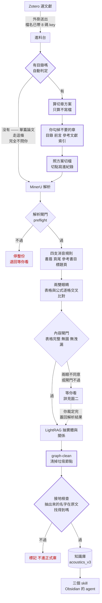
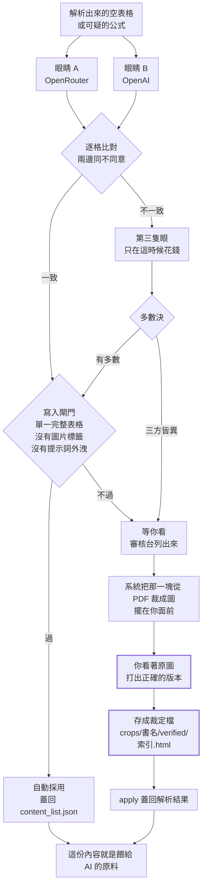
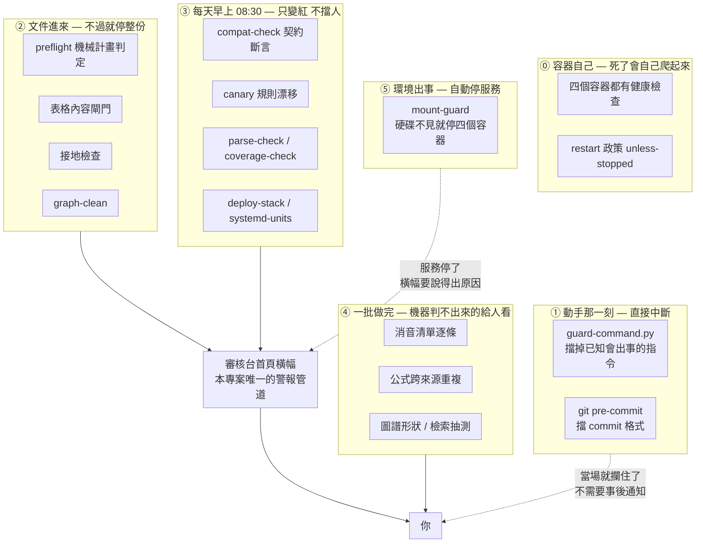
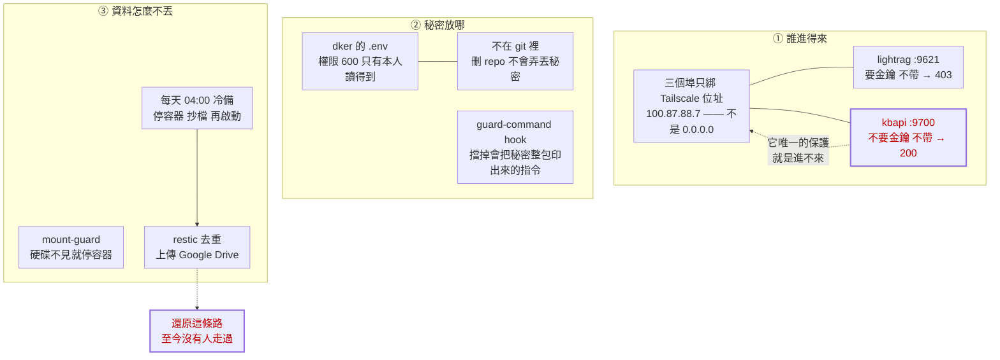
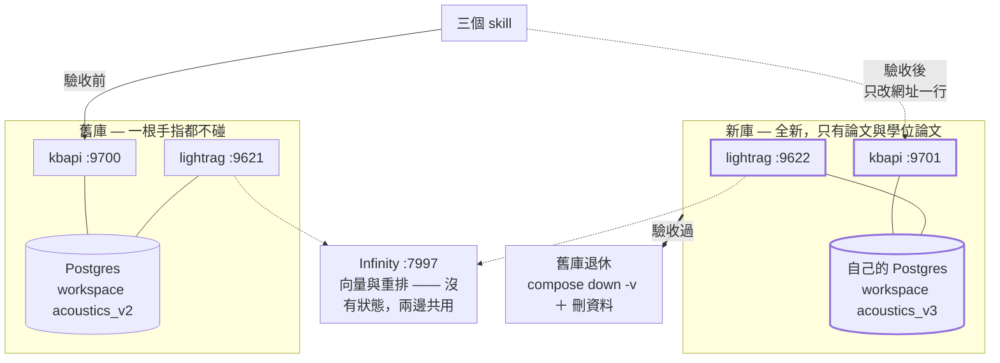
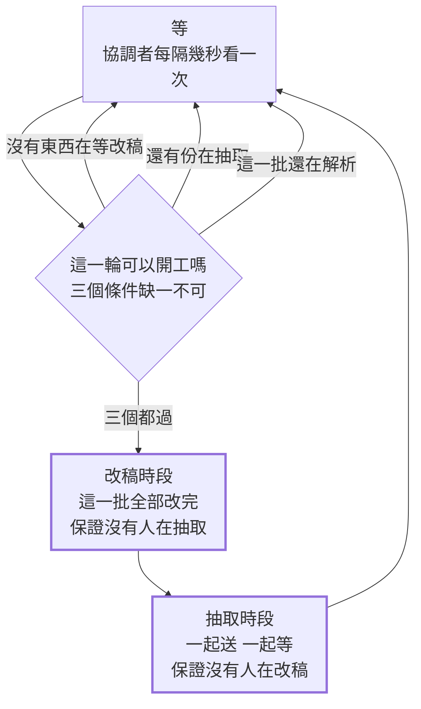
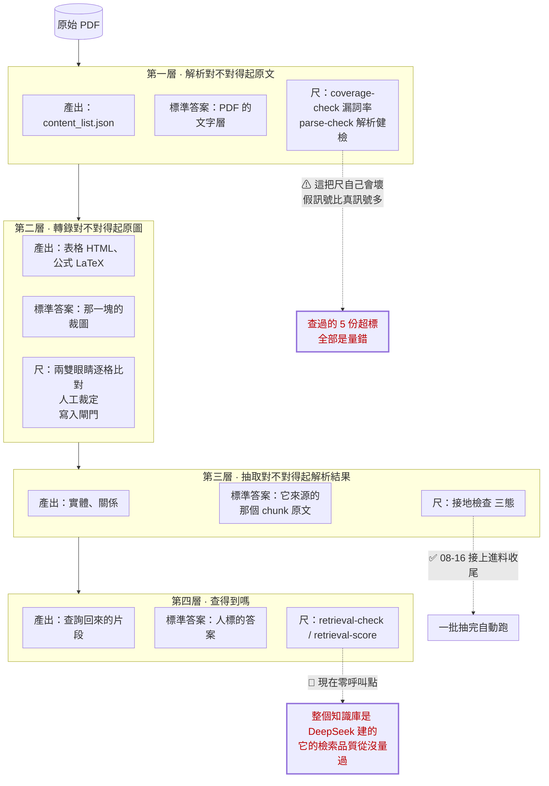

# 新庫設計 — 論文與學位論文

**狀態：草案，等 PO 裁決。** 這份文件的用途是**就地批註** —— 你直接在段落底下
寫你的意見，我在原處回。

**圖上刻意沒有數字**，數字撐不過一週。要知道現況就跑指令。

---

## 已經定了的六件事

| # | 決定 | 誰定的 |
|---|---|---|
| 1 | 範圍是**單篇論文 ＋ 學位論文**（含拆章）。教科書不進，之後再談 | PO 2026-08-16 |
| 2 | **拆章接進進料台**：送整本 → 讀目錄提方案 → 勾掉不要的 → 才切才解析 | PO 2026-08-16 |
| 3 | **全部重新解析**，不搬舊的解析成果 | PO 2026-08-16 |
| 4 | 新庫**完全獨立**：自己的 Postgres、自己的 workspace、自己的埠。skill 改網址 | PO 2026-08-16 |
| 5 | 舊庫**一根手指都不碰**，新庫驗收過就整包退休 | PO 2026-08-16 |
| 6 | **警報管道只有審核台橫幅**，不裝推播（ntfy 殘骸已於同日拆除） | PO 2026-08-16 |

**為什麼風險比想像低**：新庫要進的東西**人工裁定資產是零**。178 個人手打的修正
全部在 Mechel 那本書上（A 組），論文與拆章書合計 0 個。所以「重新解析」不會弄丟
任何不可再生的人工成果 —— 那件事平常最貴，這次剛好免費。

---

## 圖一 · 加工線：一份 PDF 從 Zotero 到可查詢

粗框是**這次新增的**，菱形是**會擋下來的關卡**。



### 兩層把不要的東西擋在外面

順序很重要，因為**第一層省下來的東西不會進到第二層**：

| 層 | 在哪一步 | 拿掉什麼 | 代價 |
|---|---|---|---|
| **第一層（新）** | 切檔之前，你勾的 | 目錄、前言、參考文獻、索引**整章** | 零 —— 那些章根本不會被解析，不花 MinerU |
| **第二層（舊）** | 解析之後 | 書眉、頁尾、參考書目段落、標題頁 | 已經解析過了 |

**這比現在好很多。** 現在目錄頁是靠第二層事後救 —— 而事後救的時候，它已經被
切塊、算了向量、進了圖譜。

⚠ **但那支切章工具認前言／附錄的關鍵字全是中文**（`目錄`、`序言`、`附錄`、`索引`）。
英文論文的 `Preface`／`Appendix`／`References`／`Index` **一個都認不出來**，
所以預設會全部勾著，要你自己取消。**這是要補的第一條。**

### 勾選那一步長什麼樣（PO 2026-08-17）

**兩個畫面，先後出現：**

```
一、先問切到哪一層
    只切「章」          →  01000_ 01100_ 01200_ …
    章 ＋ 節            →  01000_ 01001_ 01002_ 01100_ …
    （目錄有幾層就給幾個選項，讀目錄的時候就知道了）

二、再跳一個勾選框
    照第一步選的層次把整份目錄列出來，每一列一個勾
    規則先幫你勾好（前言／目錄／參考文獻／索引預設不勾）
    你只改勾錯的，按確認才開始切
```

**為什麼是兩步不是一步。** 一份 400 頁的教科書，切到「節」可能是兩三百列 ——
先選層次可以把清單縮到二十幾列。而且層次選錯的話整批檔名都要重來，
那是**切之前**就該問清楚的事。

⚠ 這一段**只有形狀，還沒設計**：勾選結果存成什麼格式（那是「重抽一模一樣重來」
的關鍵）、放在審核台哪一頁、跟消音確認清單是不是同一個畫面 —— 都還沒定。

### 拆章工具的來歷

不是新寫的。`~/data/vibevoice/` 底下那支已經在跑，而且**現在庫裡那 89 份
五碼前綴的檔案就是它切的** —— 2026-08-16 實查對照：

| 它的規則 | 庫裡的證據 |
|---|---|
| 前綴五碼，章 × 100 ＋ 節 | `01405_5.5 The influence…` |
| 超長章自動子切，加 `_partN` | 庫裡 3 份有 `_part` |
| 檔名砍在 80 字 | `…imperfect diffusene` ← 原文 `diffuseness` 82 字砍成 80 |

它已經有的、不用重做：只算不寫檔的預覽、假目錄偵測（有些 PDF 的「目錄」其實是
每頁一筆的索引，切下去變幾百個碎片）、沒目錄時的三種策略、1246 行測試。

⚠ **它的前綴會撞**：`01405_` 在兩本不同的書上都出現過。編號是「這本書裡的第幾章」，
不是全域身分。所以身分要靠檔名前面那 8 碼 Zotero key —— **而外掛 0.3.5 已經在
送了**（`zotero-plugin/lib/filename.js`）。缺的只有拆章之後的流水號，那由進料台加。

---

## 圖二 · 確認內容的迴圈：機器不敢決定的東西怎麼辦

**這一段是整個系統唯一「人真的看內容」的地方。** 其餘每一站都是機器在判形狀。



### 三件必須知道的事

**一、裁定檔的檔名是「第幾項」，不是內容。** `466.html` ＝ 解析結果的第 466 項。
而**重解析同一份 PDF 拿到的不是同一份東西**（MinerU 對表格的辨識不可重現，
鐵則第 8 條）。索引位移不會報錯，它會**安靜地把 A 表的內容補進 B 表**。

⇒ **重解析之後一定要先驗索引對齊，才能套裁定。**

**二、兩雙眼睛必須不同家族。** `pp/eyes.py` 會擋下「兩隻其實是同一個模型」——
同模型的系統性誤讀會一模一樣地重現，互相印證等於沒印證。

**三、一致不等於對。** 交叉比對只回答「兩眼同不同意」，不回答「多出了什麼」。
實測過一次：某一眼對示意圖格**捏造外部圖片網址**，兩眼剛好都幻覺時會全綠通過。
所以內容閘門掛在**寫入點**，自動採用與人工裁定走同一道。

### 這對新庫的意義

新庫要進的東西**現在人工裁定資產是零**（178 個全在教科書上）。但這條迴圈仍然要在，
因為**論文一樣有表格與公式**——只是這一輪的裁定會是全新產生的，不是搬過來的。

---

## 圖三 · 預警：什麼東西在守什麼

五層，分層的判準是 **PO 自己訂的那一條**：

> 機器判得出來且誤判便宜 → **當場擋**；誤判很貴 → **只印警告**；
> 判不出來 → **收尾 skill 給人看**



⚠ **2026-08-17 更正：B3／B4 已經接上了**，不再是「要接」。`graph-clean` 在
`45fa73a`、接地檢查在 `4ee38ca`，兩個都掛在 `intake.py:2505-2506` 的一批收尾。
⚠ 但 08-16 那晚**提交了沒重啟**，`lightrag-intake.service` 一直跑著舊碼到
08-17 00:08 —— 「接上了」與「在跑」是兩件事（`deploy-stack.py freshness` 守著）。

### ⓪ 與 ⑤ 為什麼不會打架

四個容器的重啟政策是 `unless-stopped`：**程序死掉會自己爬起來，但被人明確停掉就不會。**

而 `mount-guard` 用的正是 `docker stop`（＝明確停掉）。

⇒ **硬碟不見時容器停下來就會停在那裡，不會被重啟政策拉回去繼續寫錯地方。**
兩個機制的分工是對的，這是 2026-08-16 逐個 `docker inspect` 確認的，不是推的。

### 為什麼沒有推播

PO 2026-08-16 裁決：**警報只走審核台橫幅**。理由是他本來就每天會開審核台。

ntfy（自架推播）於 2026-08-07 拆除；機器上遺留的兩個 `-crashed` 備援單元
**已於 2026-08-16 一併刪除**（它們沒有任何觸發者，是殘骸）。

⇒ **不要再留一個假的通知路徑。** 「敲了沒人應」比「明講沒有門鈴」更糟。

### mount-guard 怎麼觸發

systemd 把「硬碟掛在哪」也當成一個單元看，叫 `data-lightrag.mount`。守衛裡那一行
`BindsTo=data-lightrag.mount` 的意思是**「它死我就死」**：

```
硬碟被拔掉 → 掛載消失 → systemd 自動停掉守衛
           → 守衛停掉時執行 ExecStop → docker stop 我們的四個容器
```

不用輪詢、不用定時檢查、不用寫程式。

**它真的動過一次**，2026-08-09 17:23:24（資料根搬到 1TB 碟那天）的 journal：

```
17:23:24  Stopping lightrag-mount-guard.service...
17:23:24  docker[881093]: lightrag-acoustics_v2
17:23:24  docker[881093]: kbapi-acoustics_v2
17:23:24  docker[881093]: lightrag-postgres
17:23:24  docker[881093]: lightrag-infinity
```

那次之後沒有人再打開它，所以它躺了一週。**2026-08-16 已重新啟動**（`enabled` ＋ `active`）。

⚠ **它只停我們的四個**，實查確認那四個剛好就是全部掛了 `/data/lightrag` 的容器。
機器上另外九個（dockge、roonserver、samba、nginx、rustdesk、vibevoice、
zotero-pdf2zh、backrest）一個都不碰。

⚠ **但 backrest 掛了整個 `/data`。** 硬碟不見時它看得到一個空的 `/data/lightrag`。
它會不會拿空目錄覆蓋好的備份 **未驗**。記在 `docs/NEXT.md`。

⚠ **守衛的 `ExecStop` 把四個容器名字寫死了。** 新 stack 叫別的名字，它抓不到 ——
**這條要跟著改**。

---

## 圖四 · 保全：秘密與資料怎麼被護著

下面每一格都是 2026-08-16 實測的，不是讀設定推的。



### 兩個要盯著的

**一、`:9700` 完全沒有認證。** 實測不帶金鑰打 `/kb/…/docs` 回 **HTTP 200**。

它唯一的保護是「只綁 Tailscale 位址，區網上的機器連不到」。這是**刻意的**
（`compose.yaml` 註解白紙黑字：綁 `0.0.0.0` 等於知識庫在區網上裸奔）。

⇒ **代價要記著：任何進得了 Tailscale 的東西，都讀得到整個知識庫。**

**二、備份的還原從來沒有人走過。** 每天 04:00 真的在跑、restic 真的有上傳，
但「停掉、換回目錄、啟動」這條路**至今無人實測**。

⇒ 所以重建的回滾手段是「指回舊庫」，**刻意不依賴冷備還原**。未走過的路不能當安全網。

### 新庫要跟著做的

| 東西 | 新庫要怎樣 |
|---|---|
| 埠綁定 | 一樣只綁 Tailscale 位址，**不要圖方便綁 0.0.0.0** |
| `.env` | 一樣放 `/opt/stacks/` 底下、600、不進 git |
| 冷備 | `backup-cold.sh` 的資料庫清單要加新的那一包 |
| mount-guard | 容器名要加上新 stack 的四個 |

---

## 圖五 · 兩個庫並存，然後舊的整包退休



**為什麼要完全獨立**：PO 2026-08-16 原話「混在一起很爛，之前就是這樣扯不清」。
兩邊資料在不同的 Postgres 容器裡，**物理上混不到**。退休就是刪一包，不是動手術。

**磁碟夠**：資料根在外接的 1TB SATA SSD 上（透過 USB 接），916G、用 13G、
**剩 858G**（2026-08-16 實測 `df -h /data/lightrag`）。

⚠ 不要看 `/data` 的數字 —— 那是內接的 NVMe，資料不在上面。這一格 2026-08-16
弄錯過一次。

---

## 圖六 · 一批怎麼流：為什麼改稿與抽取不會撞在一起

圖一畫的是**一份**怎麼流，這張畫的是**一批**。**這一段新庫完全不用改**，
它 2026-08-10 上線、實測過，跑著的就是這一版。



### 為什麼非這樣不可

**改稿（把修補蓋回解析結果）不能在 LightRAG 掃描的時候做。** 兩件事同時發生，
改到一半的檔案會被讀進去 —— 而且不會報錯。

**互斥不靠鎖。** `intake.py:1557` 的原話：

> 協調者只有一條，所以「改稿時沒有人在抽取」是由**控制流**保證的，
> 不需要證明某個鎖寫得對。

### 那個實測踩出來的縫

第三個條件（「這一批還在解析」）看起來多餘，其實不是。`intake.py:1576`：

> 一份文件從 `parsing` 落成 `planned`、再到自動放行改成 `repairing`，中間有一小段
> **兩邊都不算的空窗**。只看佇列與狀態的話，閘門會在那個縫裡誤判「解析完了」而
> 提早開跑 —— **三份文件因此被切成兩批送出去。**

⇒ 判準是「工人還在跑就是還沒完」，不是「佇列空了」。

### 新的拆章功能該接在哪

`intake.py:751-773` 已經有一道擋：**PDF 超過 200 頁就在送出去之前擋下來**
（MinerU 官方 API 的上限，2026-08-14 真的撞到過，錯誤訊息原文
`number of pages exceeds limit (200 pages), please split the file and try again`）。

**那正是新流程該接的位置。** 現在它只會說「太厚，退回去」；
新流程裡應該改成「太厚 → 讀目錄 → 提切法給你勾 → 切完各自進來」。

⚠ 但**不是每一本超過 200 頁的都該切成很多份**，也不是每一份要切的都超過 200 頁
（一本 150 頁的學位論文照樣該按章切）。**「太厚」與「該不該切」是兩件事**，
接線時不要把它們合成同一個判斷。

---

## 圖七 · 一致性怎麼確認：三層，各自拿什麼當標準答案

**這是整份文件最重要的一張。** 「抽出來的東西跟文件一不一致」不是一個問題，
是三個 —— 而且**每一層的標準答案是不同的東西**。

原則只有一句（`extract-check.py` 自己寫的）：**拿產出對來源，不要相信它。**



### 第三層是重點，而它 08-16 才終於有人在跑

接地檢查做的事很簡單：**把抽出來的每一個實體名字，拿回它來源的 chunk 搜一次。**
搜不到的標可疑。確定性、不呼叫模型、免費。

它自己的說明講得最清楚：

> **數量好看不代表內容對 —— 1,135 個實體可能全是幻覺，計數一模一樣。**

⚠ **它必須是三態，不能是「有／沒有」。** 字串比對只對散文有效，表格裡常常只有符號。
實測過一格：chunk 的原文是

```
<td>G</td><td>$G=I/\Delta U=1/Z$</td>
```

裡面**完全沒有 `Conductance` 這個字**，但模型抽出 `Conductance` 是**正確的** ——
從符號推論概念名稱正是它該做的事。

所以判定分三種：**接地 / 符號型驗不了 / 可疑**。

實測效果：二態時某一份的未接地率 55.1%（全部是假警報）；改三態之後降到 **3.4%**。

### 第一層那把尺，主要在量它自己壞掉

漏詞率的算法是「PDF 文字層有的詞」減「解析結果有的詞」。**兩個母體，而壞的一直是
對照組那一邊。**

15 份超標裡逐份查證過 5 份，**全部是假訊號，五種不同的壞法**：

| 真正的原因 | 長什麼樣 |
|---|---|
| 頁側直式浮水印被讀成碎片 | `A c o usti cs` → `usti` |
| 雙欄版面讓同段被輸出兩次 | 缺詞第一名是 `the`（336 次）—— **冠詞不可能被漏掉** |
| 1979 掃描件沒有詞邊界 | `room acoustics` → `roomacoustics` |
| 數學字型沒有可用編碼 | 吐出 `dddd`／`nnjj`／`mmmmmm` |

⇒ **壞的方向是單向的：對照組讀壞 → 漏詞率被推高。**
第一份的紀錄寫得最直白：**解析做得越好，這個數字越高。**

⚠ **對一支會叫的尺下裁決之前，先問它自己記了什麼。** `coverage-check --doc X` 會印
「已查證於某日：…根因：…」，跑不帶 `--doc` 的總表看不到。

### 新庫這一輪要決定的

| 層 | 這一輪要怎樣 |
|---|---|
| 第一層 | 尺不改，但**紅燈只印警告不擋**（誤判太貴） |
| 第二層 | 照舊，完全不用改 |
| **第三層** | ✅ **08-16 已接進一批收尾**（`4ee38ca`）。⚠ 它現在只**記進體檢表**，還不會擋 —— 「不過就擋」那半還沒做 |
| 第四層 | 這一輪要不要量？**還沒裁。** 現在整個知識庫是 DeepSeek 建的，而它的檢索品質從來沒量過 |

---

## 消音規則：現在是什麼，以及四條該檢討的

**消音 ＝ 那段文字不會被切塊、不會算向量、不會餵給 AI。** 但它**沒有被刪掉**，
原文留在 `_pp_original_*` 裡，可還原、可查帳（鐵則第 2 條）。

### 現在只有三支在消音

| 規則 | 消什麼 | 判準是什麼 | 消太多就停下來的門檻 |
|---|---|---|---|
| `layout_noise` | 書眉、頁尾、頁註、側邊、頁碼 | **重複幾次**，不是「型別叫什麼」。重複 ≥ 3 次，或出現在一半以上的頁 | 10% |
| `reference_section` | 參考文獻整段、致謝整段 | 標題比對抓 `References`／`Acknowledgement`，抓到就消到正文恢復為止 | 30% |
| `title_block` | 標題頁的作者、單位、投稿與出版資訊 | **位置只圈範圍**（第 0 頁、標題後最多 25 項），**內容才是判準**（12 字以上算散文就不消） | — |

另外三支**不是消音**，常被一起講但做的事完全不同：

| 規則 | 做什麼 |
|---|---|
| `chart_type` | 把 MinerU 的 `chart` 改成 `image` —— **不改的話整張圖在索引裡根本不存在** |
| `empty_table` | 挑哪些空表格值得修。**最重要的是不修什麼**：含 `` 的多半是正常的表，`` 是儲存格裡的電路符號 |
| `latex_fix` | 三個機械的 LaTeX 修補，位置錨定、不呼叫模型 |

### 現在被消掉的量長這樣

| 是什麼 | 項數 | 字元 |
|---|---:|---:|
| **參考書目** | 382 | **1,199,041** |
| 書眉 | 4,892 | 126,899 |
| **正文型別的區塊** | 946 | 101,282 |
| 頁尾 | 1,155 | 56,994 |
| 頁註／側邊／頁碼 | 613 | 21,140 |

（2026-08-16 在舊庫量的，母體是 317 份。新庫要重量。）

### 四條檢討的結論（PO 2026-08-16 全部裁完）

| | 裁決 |
|---|---|
| ① 參考書目消音 | **維持原判** —— 理由與比例無關 |
| ② 那 946 項正文型別 | **進確認清單**，不再自動消 |
| ③ `title_block` 對拆好的單章 | **量完發現問題不在拆章**，見上面那條裁決 |
| ④ 兩個沒依據的門檻 | **量完了，值不變但有母體了**（`9b6edda`） |

**① 的量**：參考書目消音比例，C 組（論文）178 份中位 **13.7%**、95% 25.5%、
最高 49.0%（綜述論文，參考清單本來就巨大）。30% 門檻落在約第 98 百分位，
全庫 3 份超過 —— 那 3 份會停下來等人看，**那是想要的行為**。
⚠ 新庫只有論文，C 組分佈即全庫分佈；**重抽後要重量**。

**② 的量**：946 項、101,282 字元、平均每項 **107 字元**（一行看得完）。
型別是 `text`，是**唯一「正文被判該刪」的一類** —— 其餘六類從型別就看得出是版面雜訊。
舊事故就發生在這裡（附錄被當致謝消掉）。
⇒ 確認清單從約 631 行變成約 1,600 行，但**一次性、存檔、重抽沿用**。

**④ 的量**：散文字數門檻的兩堆中位數是 **9 對 53**，空隙很大，12 落在裡面。
⚠ 但字數不是主要防線 —— 828 個有訊號的項目裡 325 個（39%）字數 ≥12，
是靠大寫比例擋下來的。**兩個條件是 AND。**

⚠ **量法本身踩過一次坑**：直接量磁碟上的解析包會得到假的 0（它們已經套用過消音，
`text` 是空的）。正確做法是**先把 `_pp_original_*` 還原回記憶體再跑規則**。
靠鐵則第 7 條「乾淨的 0 先當成量錯」抓回來的。

### 原本的四條（留著看當初為什麼問）

**① 新庫只有論文，參考清單的比例會放大。**
現在被消掉的字元**八成是參考書目**。教科書章節沒什麼參考清單，**論文每篇都有**。
PO 2026-08-16 已裁決「這是決定不是代價」（文獻之間的關聯靠內容圖譜連，不靠那些
名字），但**量級變了**，值得重看一次再確認。

**② 那 946 項、10 萬字的「正文型別」只抽樣看過 1 項。**
其餘六類從型別就看得出是版面雜訊；**只有這一類是正文被判該刪** —— 而舊事故就
發生在這裡（**附錄被當致謝消掉**）。

**③ `title_block` 對「拆好的單章」刻意不開火 —— 而新庫會有大量拆好的單章。**
程式註解白紙黑字（`title_block.py:220-222`）：

> 開火條件刻意嚴格 —— 第一項必須是 `text_level == 1` 的文件標題而且在第 0 頁。
> 教科書章節第 0 頁是從半句話開始的正文，第一項沒有 `text_level`，於是整條規則
> 不開火。**那是設計，不是漏掉。**

⇒ 學位論文按章切之後，**每一章都是「拆好的單章」**。這條規則對它們等於關著。
**新流程直接改變了這條規則的適用範圍**，要決定怎麼辦。

**④ 那幾個門檻是量出來的還是調出來的？**
`10%`（版面雜訊）、`30%`（參考文獻）、`25 項`（標題頁範圍）、`12 字`（散文下限）。
鐵則第 5 條：**門檻用量的，不要用調的。** 我沒查它們的來源，**這是未驗**。

---

## 裁決：消音改成「規則只做確定的，其餘進確認清單」

**PO 2026-08-16 裁決。** 這條取代原本規劃的「繼續放寬規則 ＋ 逐個補保護」。

### 為什麼換路

補丁路走到第三步就看得出形狀了：

```
放寬圈範圍  →  更多項目走進內容判準  →  撞到已知誤判  →  再補一個保護
                                                          ↑ 每個保護都可能安靜失效
```

實測的證據：放寬之後那 18 份裡，**有 2 份的論文標題會被判成作者行而消掉**
（`2025 - EVALUATING THE APPLICABILITY OF STATI…`、`2026 - Nonlinear Dynamics…`，
都是大寫很多的標題）。而**保護不能用「是不是標題」來判** —— 實測那 18 份的
論文標題有 7 份被標成 `lvl=2`、5 份完全沒標、3 份 `lvl=1`，而出事的兩份
剛好一個 `lvl=1`、一個沒標。

⇒ **每加一層保護就多一個會安靜失效的東西。** 換路。

### 新的形狀

| | |
|---|---|
| 規則 | **只消它百分之百確定的**（有錨定字串的那幾類） |
| 其餘 | **全部進清單**，不自動消、也不安靜漏掉 |
| 人 | 一批一次，掃過**預先勾好**的清單，只改勾錯的 |
| 結果 | **存檔**，重抽沿用，不必重做 |

這同時解掉三件事：**誤消風險歸零**、「安靜漏掉」消失、以及那批無人看管的
`held` 終於有出口。

### 量：人要看幾項

2026-08-16 在 dker 全母體實跑（317 份）：

```
292 項   規則現在已經在「保留待查」的     ← 散在 108 份，**目前沒有任何彙總出口**
339 項   沒開火那 57 份第 0 頁的候選      ← 已扣掉一眼是正文的（散文）
─────
631 項   散在 165 份，平均每份 6 項
```

⚠ **這不是 631 個決定。** 規則會先勾好，人只改勾錯的 —— 跟外掛選附件、
拆章確認同一個形狀。一份大概 6 行。

⚠ 631 是**舊語料**的數字。新庫重抽後會不一樣，而且論文佔比更高，可能更多。

⚠ PO 的判斷：**除了第一批，之後新增的論文不會太快**，所以一次性成本可以接受。

### 模型（VLM／LLM）在這裡的角色

**能用，而且看圖比讀文字適合** —— 封面頁用眼睛看半秒就知道，文字判準卻要猜
大寫比例、猜分隔符。設備已經有（裁圖、兩隻眼睛、交叉比對、負向對照）。

但角色是**先幫你勾，不是代替你確認**：

```
兩隻眼睛都說是作者區塊  →  預先勾好，人掃過去
兩隻不同意              →  進清單，人決定
```

⇒ 人要看的從 631 項降到「分歧的那些」。

**不讓模型直接決定的兩個理由，第二個比較重要：**

1. 模型直接消就回到誤消風險，而**消錯不會有任何訊號**
2. **模型會換代。** 今天的答案跟明年不一樣，而人分不出是規則改壞了還是模型變了
   （鐵則：易腐觀察一律不得寫成流程中的自動裁決規則）

**關鍵設計 —— 存下來的是人的確認，不是模型的輸出：**

```
模型的判斷  →  只當「預先勾好」，不存檔
人的確認    →  存檔，重抽沿用
```

⇒ **換模型不會改變已經確認過的東西。** 這一條讓模型的不確定性變成無害的。

### 這條裁決取消了什麼

原本規劃的 2a／2b（再放寬兩次圈範圍、多救 18 份）**不做了**。
已經做完的第一段（錨定字串那條，`2beeb87`）**保留** —— 它只在有明確字串時開火，
屬於「百分之百確定」那一類，正是新形狀要保留的部分。

---

## 正確性在哪裡把關 —— 誠實的答案

**沒有單一的關卡。而且沒有任何一層在問「這句話講的物理對不對」。**

系統驗的是**忠實度**（產出跟來源一不一致），不是**正確性**（原文說的對不對）。
論文本身寫錯了，我們照樣忠實地把它抽進去 —— 那不是 bug，是範圍。

| 層 | 在把什麼關 | 現況 |
|---|---|---|
| 一 解析 vs PDF | 字有沒有掉 | 有尺，但**尺自己會壞**，假訊號多於真訊號 |
| **二 轉錄 vs 裁圖** | **表格與公式抄對了沒** | ✅ **這層最紮實** —— 兩雙眼睛 ＋ 人工裁定 ＋ 寫入閘門 |
| 三 抽取 vs 解析結果 | 抽出來的名字原文裡有沒有 | 有尺，✅ **08-16 接進一批收尾**（`4ee38ca`） |
| 四 查得到嗎 | 問了回得出東西嗎 | 有尺，🔴 零呼叫點 |

⇒ 原本**真正在把關的只有第二層，而它只管表格與公式** —— 散文抽出來的實體與
關係對不對，沒有任何人在看。第三層接上之後這個洞補起來了。

⇒ 那一條（原「要動的東西」第 3 項）本來就不是錦上添花，
**它是這一輪唯一會實質提高正確性把關的改動**，所以先做。剩下沒有守的是第四層。

---

## 要動的東西，一共七樣

| # | 動什麼 | 為什麼 | 圖 |
|---|---|---|---|
| 1 | 進料台加「讀目錄 → 提方案 → 你勾 → 才切」 | 這輪最主要的新功能 | 一 |
| 2 | 切章工具的前言／附錄關鍵字加英文 | 現在只認中文，英文書全漏 | 一 |
| ~~3~~ | ~~接地檢查與 `graph-clean` 接進進料收尾~~ **已完成** | `graph-clean` 在 `45fa73a`、接地檢查在 `4ee38ca`，兩個都掛在 `intake.py:2505-2506` 一批收尾 | 三 |
| 4 | 三個 skill 改網址與 workspace | 新庫完全獨立 | 五 |
| 5 | `mount-guard` 的容器名加上新 stack 的四個 | 現在寫死舊名字，抓不到新的 | 三、四 |
| 6 | `backup-cold.sh` 的資料庫清單加新的那一包 | 不加就是新庫沒有備份 | 四 |
| 7 | 重解析之後**先驗裁定索引對齊再套用** | 索引位移會安靜地把 A 表補進 B 表 | 二 |

---

## 還沒裁的

- [ ] 新 workspace 叫什麼（草案寫 `acoustics_v3`，現在改免費，建好之後改要動 13 張表）
- [ ] 體檢表那八格，這一輪要補幾格、哪幾格明講「不做」
- [ ] 十二道閘門那十道零呼叫點：接回去／刪掉／標記，三選一
- [ ] 「檢查上線前要證明它分得出東西」要不要這一輪就上（防 `parse-check` 的 WARN 佔 89% 再發生）
- [ ] backrest 在硬碟不見時的行為（見上）
- [ ] **參考書目消音在「只有論文」的新庫要不要維持原判**（比例會放大，見消音檢討 ①）
- [ ] **那 946 項正文型別要不要逐條看**（舊事故就在這裡，見 ②）
- [x] ~~**`title_block` 對拆好的單章要不要開火**~~ → **量完了，問題不在拆章**。
      漏的是單篇論文前面的期刊封面頁。第一段（錨定字串）已做（`2beeb87`），
      其餘改走「確認清單」，見上面那條裁決
- [ ] **確認清單長什麼樣、放哪裡**（審核台？獨立畫面？）—— 裁決定了，介面還沒設計
- [ ] **確認結果存成什麼格式**（沿用 `verdicts/` 的形狀？）—— 這是「重抽不用重做」的關鍵
- [ ] 兩隻眼睛預先勾好那一段，這一輪要不要做（先人工也行，只是慢）
- [ ] **四個門檻的來源要不要查**（量的還是調的，鐵則第 5 條，見 ④）
- [ ] 第四層（檢索品質）這一輪要不要量（DeepSeek 建的庫，從沒量過）

---

## 這份文件沒有回答什麼

- ~~**切章工具搬進 lightrag 之後怎麼跑**，還沒設計。它現在住在別人的專案裡。~~
  **2026-08-17 已搬進來**（`scripts/chapters/`，1277 行，只留 PDF、EPUB 的 265 行
  已刪）。**但「怎麼接進進料台」還是沒設計** —— 搬的是碼，不是流程。
  ⚠ 它原本那 2678 行測試**沒有跟過來，因為那些測試本身就跑不動了**（比對對象是
  vibevoice v1 的原始碼，那份已被刪除；實跑 7 個檔在 collection 就
  `FileNotFoundError`）。現在的覆蓋是重寫的 19 個，而 `pdf_splitter.py` 只有 6 個。
- **學位論文有幾份**沒量過。B 組 120 份裡有幾份是學位論文、幾份是拆章教科書，
  要去部署機數。
- **重新解析的實際時間與費用**沒估。MinerU token 2026-09-04 到期。
- **切章方案紀錄檔長什麼樣**沒定。那是「未來重抽一模一樣重來」的關鍵，但格式還沒設計。
